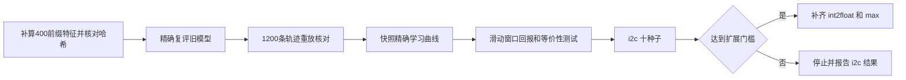

# 四步实验后续计划：精确复评与跨回合回报

本计划接在 [四步学习率实验：结论与下一步](four-step-lr-review.md) 之后，采用收缩版方案：

1. 利用四步穷举表，对旧实验的冻结模型和训练快照做精确复评；
2. 只改一项——回报标准化改为跨回合滑动窗口；
3. i2c 跑满 10 个种子，达到事先写下的门槛后，再补齐 int2float 和 max。

本文只是计划，没有修改代码，也没有启动实验。文中引用的数字来自分支 `codex/four-step-lr-comparison` 已提交的文件。

## 1. 可行性核对

整体可行，成本不高。

### 1.1 穷举表可以直接用，但缺状态特征

[experiments/ten-step-optimality/candidates.csv](https://github.com/Shun-Zhan/drills/blob/codex/four-step-lr-comparison/experiments/ten-step-optimality/candidates.csv) 每个电路有 2801 行，覆盖 0–4 步的全部序列。每行有 LUT、层数、是否可行和结构哈希，但没有状态特征。

需要为 0–3 步的 400 个前缀补算特征。第 4 步之后的状态不参与决策，不用算。补算时必须按 `FPGASession` 的原路径：读原电路、重放整条序列、写出未映射网表，再用 Yosys 和 ABC 提取特征。补算出的结构哈希、LUT 和层数要与表中逐行一致。

### 1.2 决策时的状态可以确定性重建

四步实验的状态归一化是 `episode_welford`（[protocol.yml](https://github.com/Shun-Zhan/drills/blob/codex/four-step-lr-comparison/experiments/four-step-lr/protocol.yml)）。第 t 步的归一化状态只取决于前缀 s0..st 的原始特征；ABC 每步都从原电路重放，结果是确定的。

实现方式：沿前缀树深度优先遍历，每个分支复制一份原 `Normalizer` 对象，用 `float32` 网络计算 softmax。不要另写归一化公式，否则浮点结果可能与训练时不一致。

### 1.3 单条轨迹的“最好”可以从表中算出

规则与 `FPGASession.rank` 相同：可行优先，再比 LUT，再比层数。初始映射也参与（`include_initial: true`）。

给定单条轨迹最好 LUT 的分布函数 F，独立取 k 次后最好值的分布是 `1 - (1 - F(x))^k`。

### 1.4 已有 1200 条轨迹可以严格核对

[evaluate.py](https://github.com/Shun-Zhan/drills/blob/codex/four-step-lr-comparison/experiments/four-step-lr/evaluate.py) 在每个 `rollout.json` 中保存了动作序列、最好结果和评估种子。

最严格的核对方法：用 `torch.Generator().manual_seed(evaluation_seed)`，按精确概率重放 `torch.multinomial`，要求 4 个动作逐一相同，最好 LUT 也一致。另外检查每个策略的 2401 条序列概率之和为 1，均匀随机的每条序列概率为 1/2401。

### 1.5 必须在原训练机器上运行

模型、快照和 `rollout.json` 都在 git 忽略的 `results/four-step-lr/` 目录，GitHub 上没有。

## 2. 对原方案的修正

### 2.1 “两正两负”的说法不准确

同一回合内 4 个标准化后的回报之和为 0、方差为 1，正负个数可以是 1/3、2/2 或 3/1。critic 拟合的也是这些零均值目标，所以优势整体仍接近零和，回合之间的好坏差异被抵消。这个判断不变。

### 2.2 回报窗口：滑动窗口

- 前 8 轮沿用原来的回合内标准化。
- 从第 9 轮起，每个步位只用此前 8 个回合在该步位的回报计算均值和标准差，标准差下限为 1。
- 当前回合在完成更新后才进入窗口。
- 检查点保存窗口内容，中断后能准确续跑。

之所以不用“固定前 8 轮”：那样基线会一直停在初始随机策略的水平，策略变好后优势全部为正，等效步长会漂移。不含当前回合，基线就与当前动作无关，梯度估计无偏。

这项修改还会改变优势的大小，从而改变等效步长，这个附带效应无法隔离。每轮记录优势的平均绝对值 `mean|A|`，与旧 0.01 并列报告。

### 2.3 取消初筛，i2c 直接跑满 10 个种子

原方案选了 0、2、4、7、9 作为初筛种子。下表是按 `evaluation.csv` 抽样估计的单次平均差距（LUT）：

| 种子组 | 旧 0.01 | 初始网络 | 均匀随机 |
|---|---:|---:|---:|
| 0、2、4、7、9 | 19.8 | 19.2 | 19.6 |
| 1、3、5、6、8 | 13.2 | 20.0 | 20.0 |

在初筛种子上，旧 0.01 比初始网络和均匀随机都差，新方法只要回到平均水平就能“优于旧 0.01”，属于均值回归。另外，“5 个种子中 3 个改善”在没有真实效果时也有约一半概率达到。

i2c 多跑 5 个种子只多约 10 分钟，因此直接跑满种子 0–9。种子 7、9 的结果仍单独列出，用来观察旧实验中的过早收敛是否消失。

## 3. 补充建议

1. **扩展门槛事先写下。** i2c 十个种子必须同时满足以下条件，才扩展到 int2float 和 max：
   - 单次期望差距的平均值低于旧 0.01；
   - 至少 6/10 个种子改善；
   - 平均值不差于初始网络。
2. **对快照做精确复评，画学习曲线。** 旧训练保存了第 0、50、100、150、200、250 轮的快照。精确复评是秒级计算，每个快照都能算出单次期望差距，从而看出旧 0.01 的种子 7、9 是在哪一段塌缩的。新实验在同样的快照点保存和评估。
3. **说明均匀随机是常数。** 精确口径下，每个电路的均匀随机只有一个值，没有按种子的波动，与它比较时区间只反映训练种子的波动。表中还能算出均匀随机单条轨迹命中四步最优的概率，作为“命中率高于随机”的理论门槛。
4. **max 预期不会因这项修改变好。** max 卡在 42 层是奖励的问题，回报修改不针对它。max 的主指标写死为单条轨迹的可行概率，零结果不作为否定回报修改的证据。精确口径下很小的可行概率也能算出来，不再受 10 次抽样分辨力的限制。
5. **增加 critic 诊断，改用按轨迹加权的熵。**
   - 窗口标准化让 critic 的目标随时间变化，每轮记录 critic 损失和解释方差，确认它跟得上。
   - 熵改为按精确轨迹概率加权的平均熵，取代固定探针上的熵，更接近策略实际经过的状态。
6. **新代码默认关闭，并标明主比较。**
   - 新回报处理用配置开关控制，默认走原路径，旧实验的指纹不变。
   - 3 个电路 × 3 个对照共 9 组比较。只有“i2c 上新方法对旧 0.01”是主比较，其余标为探索性。

## 4. 验证

- 1200 条冻结轨迹的动作重放和最好 LUT 全部一致；概率之和为 1；均匀随机的每条序列概率为 1/2401。
- 新旧实验前 8 轮的权重一致，第 9 轮的动作一致；中断续跑与连续训练的结果一致；每个种子都是 1000 个优化动作。
- 最终判断同时报告三项：按种子重采样的区间、配对 t 区间、改善种子数。十个种子时重采样区间偏窄，三者一致才下方向性结论。即使平均值改善，区间跨零时也报告为不确定。
- 与初始网络、均匀随机的比较单独报告，不把“优于旧 0.01”写成“已经学会”。贪心序列必须命中最优不作为硬门槛。
- 训练期同样 1000 个动作内见过的最好 LUT 继续作为辅助指标报告，不参与门槛。

## 5. 预算估计

- **i2c，每个种子约 3 分钟。** 依据：100×10 实测每个种子 190–245 秒，四步序列更短，每步重放的开销更小。3 个进程并行，10 个种子约 12–20 分钟。
- **int2float 和 max 共 20 次训练，约 20–40 分钟。** max 最慢。
- **特征表：** 3 个电路 × 400 次“ABC + Yosys + ABC”，几分钟。精确复评本身是纯矩阵运算，秒级完成。

## 6. 执行顺序

整理本文时使用了 AI 核对分支中的代码和数据、估算预算并起草计划。
