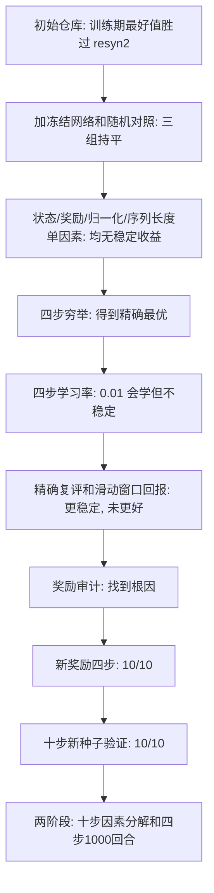

# FPGA 版 DRiLLS 改进实验总报告

本文整理 [Shun-Zhan/drills](https://github.com/Shun-Zhan/drills) 从初始仓库到分支 `codex/lr-reward-two-stage-20260929`（提交 `b9de818`）的全部改进过程：每一步发现了什么问题、改了什么、结果如何、哪些结论站得住。数字摘自各分支已提交的报告和 CSV；标明"本文计算"的数字由已提交的 CSV 重算，没有重新训练。

## 结论

1. **改进成功的部分：** 新奖励配合学习率 0.01 和滑动窗口回报，让冻结策略本身变好了，而不只是训练期间碰巧见过好解。
   - 十步、同样 100×10 预算：i2c 单条轨迹平均最好 LUT 从原始实现的 319.7 降到 306.8；max 可行轨迹比例从 20.0% 升到 44.4%（3 个种子，探索性）。
   - 奖励这一项在全新种子 20–29 上做过事先登记的检验，i2c 和 max 都是 10/10 改善，Holm 校正后 p≈0.002。
   - 训练期最好值（原仓库的口径）：i2c 303.7 → 298.0，max 772.3 → 765.3，int2float 44.0 → 43.7；对应 resyn2 为 322、777、48。
2. **起作用的是奖励，学习率 0.01 是必要条件。** 原奖励在 i2c 上有 500 条四步序列并列最高分，在 max 上最高分是一条超限序列；只调学习率或回报处理都无法让策略指向最优。
3. **还没解决的问题：**
   - 四步训练到 1000 回合后，max 有 9/10 个种子的贪心序列达到最优；但 i2c 10 个种子全部收敛到 313（最优 312），int2float 全部收敛到 46 或 47（最优 44），最优命中概率几乎降到 0。原报告只写了期望差距的改善，没有写这一点（本文第 4 节）。
   - int2float 在十步上没有改善。主要原因是最优序列藏在平均表现差的分支里，以及可行之后超限不受罚（第 5 节）。
   - max 上尚未证明同预算胜过均匀随机；没有测过没见过的电路。

## 1. 起点：原始结果说明不了学习

初始仓库 `main`（`adf7bef`）把论文的 DRiLLS 改成 LUT6 映射：7 个 ABC 动作，100 回合 × 10 步，A2C，奖励是 LUT 增减和层数升降的查表。README 的参考结果是训练期间见过的最好可行解：

| 电路 | 层数上限 | resyn2 LUT | 参考结果 LUT |
|---|---:|---:|---:|
| int2float | 3 | 48 | 44.00 |
| i2c | 4 | 322 | 303.67 |
| max | 41 | 777 | 772.33 |

问题在于口径。一次训练看过约 1100 个映射结果，而 resyn2 只跑一条脚本。`learning-effectiveness` 分支加了冻结初始网络和均匀随机两组对照，同样预算下三组的最好值处在同一范围：

| 电路 | 训练 | 冻结初始网络 | 均匀随机 |
|---|---:|---:|---:|
| int2float | 44.0 | 43.7 | 44.0 |
| i2c | 303.7 | 304.7 | 304.3 |
| max | 772.3 | 770.3 | 774.7 |

也就是说，比 resyn2 好的部分来自搜索预算，不是学到的策略。详见 [fpga-experiment-review.md](fpga-experiment-review.md)。

## 2. 改进过程

### 2.1 第一轮单因素尝试：都没有稳定收益

| 实验 | 分支 | 改了什么 | 结果 |
|---|---|---|---|
| 性能状态 | `new-state` | 状态加入 LUT 比例和层数余量 | 3 个种子时 max 少 3.3 LUT，扩到 10 个种子后只少 0.1，区间含 0 |
| 比例奖励 | `change-rewards` | 可行区奖励改为 LUT 变化比例 | 9 组最好 LUT 与旧奖励完全相同，8 组连最优序列和出现轮次都相同 |
| 奖励尺度 | 同上，`i2c-return-handling` | 奖励乘 10 | 被回合内回报标准化约掉，结果完全相同 |
| 序列长度 | 同上，`i2c-learning-horizon` | 每回合 10 步改 30 步 | 训练和冻结都少约 15 LUT，训练不优于冻结 |
| 固定尺度归一化 | `codex/fixed-state-normalization` | 状态除以初始值，不再回合内标准化 | i2c 平均多 1.67 LUT，未过门槛 |
| 200×5 | 同上 | 更短序列、更多回合 | 仅 i2c 固定策略少约 3.2 LUT，训练期最好值不领先 |
| 分段更新 | `codex/segmented-updates` | 50 步长轨迹分段更新 | 比原版少约 20 LUT，但长轨迹均匀随机同样水平 |

这一轮的教训：
- 回合内回报标准化会抵消奖励尺度和奖励形状的变化，改奖励之前必须先处理它；
- 3 个种子的均值方向在扩到 10 个种子后会反转；
- 训练期最好值奖励"多试"，分不出策略好坏。

### 2.2 建立标准答案：四步穷举

`ten-step-optimality` 无剪枝枚举了 0 到 4 步的全部序列（每个电路 7⁴ = 2401 条），得到四步精确最优：int2float 44、i2c 312、max 781。

这让后续实验可以做两件以前做不到的事：
- 对冻结策略精确计算单次期望差距、可行概率和最优命中概率，不再有抽样噪声；
- 离线检查一个奖励的最高分序列是不是真正的最优序列。

### 2.3 四步学习率实验

分支 `codex/four-step-lr-comparison`，报告 [four-step-lr/report.md](https://github.com/Shun-Zhan/drills/blob/cfd580f/experiments/four-step-lr/report.md)，评审 [four-step-lr-review.md](four-step-lr-review.md)。

- 0.001 几乎不学：策略熵只从约 1.92 降到 1.73–1.88（均匀分布为 1.946）。
- 0.01 会收敛，但方向不稳定。i2c 种子 7 塌缩到差的序列；max 越训练越不可行。
- 报告的主指标是"10 次取最好"，它奖励结果的多样性，刚好掩盖了 0.01 在单次尝试上的改进。

### 2.4 精确复评和滑动窗口回报

提交 `cfd580f`，报告 [four-step-followup/report.md](https://github.com/Shun-Zhan/drills/blob/cfd580f/experiments/four-step-followup/report.md)，评审 [four-step-window-return-review.md](four-step-window-return-review.md)。

改动只有一项：从第 9 回合起，每个步位用此前 8 个回合的回报算均值和标准差，标准差下限为 1。

- 精确复评：i2c 上 0.001 其实在慢慢学（期望差距 20.50 → 18.76）；max 上 0.01 的可行概率从 0.0128 降到 0.000124。
- 滑动窗口对旧 0.01：i2c 期望差距 14.42 对 16.87，但区间 [-1.41, 8.06] 含 0，改善只有 5/10。均值几乎全部来自旧版种子 7 的塌缩。
- 稳定性明显提高：种子间标准差从约 7.8 降到约 2.7，10/10 个种子优于初始网络。

### 2.5 奖励审计：找到根因

用穷举表计算原奖励下全部 2401 条序列的累计奖励（γ=0.99）：

| 电路 | 原奖励最高分序列数 | 其中最优 | 问题 |
|---|---:|---:|---|
| int2float | 12 | 2 | 最高分里混有 45、46 LUT |
| i2c | 500 | 4 | 只数 LUT 下降几次，不看降多少；`rewrite -z` 连用 4 次（325）也是满分 |
| max | 1 | 0 | 唯一最高分终点 42 层，超限；最优可行序列要中途临时变差，最多只得 4.95 |

结论：在这个奖励下，任何回报处理都只能让策略更稳定地收敛到某条满分序列，而满分序列大多不是最优。

### 2.6 新奖励

规则（`experiments/four-step-reward/reward.py`，按初始 LUT 的百分比计分）：

- 第一次满足层数上限：100 + LUT 相对初始值的下降百分比，再扣回此前的层数引导奖励；
- 已经可行、刷新最好 LUT：下降量占初始 LUT 的百分比；
- 仍未可行、层数创本回合新低：按降层数给少量引导奖励（系数 10）；
- 其他情况：0。

可行之后奖励之和等于最终 LUT 的下降比例，没有来回刷分的空间。离线审计：三个电路的最高分序列分别为 2、2、7 条，全部最优。

### 2.7 新奖励的四步实验

提交 `682ee92`，报告 [four-step-reward/report.md](https://github.com/Shun-Zhan/drills/blob/fc77eea/experiments/four-step-reward/report.md)，评审 [four-step-reward-review.md](four-step-reward-review.md)。

训练改用查表环境：前缀特征和每步 LUT/层数都从已认证的穷举结果读取，不调用 ABC。用它重跑滑动窗口 i2c 实验，10/10 个最终网络哈希与真实 ABC 训练一致。

| 电路及指标 | 滑动窗口版 | 新奖励 | 改善种子 |
|---|---:|---:|---:|
| i2c 单次期望差距 | 14.42 | 4.16 | 10/10 |
| max 单次可行概率 | 0.00006 | 0.445 | 10/10 |
| int2float 单次期望差距（次要） | 3.66 | 2.81 | 8/10 |

### 2.8 十步验证

提交 `fc77eea`、`f2de58a`，报告 [ten-step-reward-validation/report.md](https://github.com/Shun-Zhan/drills/blob/f2de58a/experiments/ten-step-reward-validation/report.md)。

- **先前的门槛：** 种子 0–4，比较训练期最好值，要求 5/5 个种子同时胜过冻结网络和均匀随机。i2c 5/5 通过；max 4/5 未通过，种子 0 为 764 对 763。`f2de58a` 已把这一结果补记进报告。
- **正式检验：** 新种子 20–29，协议先固定；两组只差奖励；主指标是冻结策略独立抽 30 条轨迹的表现。

| 电路及主指标 | 原奖励 | 新奖励 | 初始网络 | 改善种子 | Holm p |
|---|---:|---:|---:|---:|---:|
| i2c 每条轨迹平均最好 LUT | 311.1 | 306.8 | 319.6 | 10/10 | 0.002 |
| max 可行轨迹比例 | 4.7% | 57.7% | 17.7% | 10/10 | 0.002 |

### 2.9 两阶段实验

提交 `d7d27b6`、`b9de818`，报告 [lr-reward-two-stage/report.md](https://github.com/Shun-Zhan/drills/blob/b9de818/experiments/lr-reward-two-stage/report.md)。

**第一阶段：十步因素分解。** 100×10、种子 0–2，5 组各评估 30 条冻结轨迹。

| 配置 | int2float LUT | i2c LUT | max 可行比例 |
|---|---:|---:|---:|
| 原始实现 | 46.64 | 319.69 | 0.200 |
| 窗口 / 0.001 / 旧奖励 | 46.63 | 318.53 | 0.178 |
| 窗口 / 0.001 / 新奖励 | 46.52 | 316.26 | 0.267 |
| 窗口 / 0.01 / 旧奖励 | 46.94 | 312.86 | 0.078 |
| 窗口 / 0.01 / 新奖励 | 46.71 | 306.78 | 0.444 |

从这张表可以读出：

- **在 0.001 下，滑动窗口本身几乎没有作用**：i2c 少 1.2 LUT，max 可行比例降 0.02。
- **学习率 0.01 配旧奖励，对 i2c 有用，对 max 有害**：i2c 少 5.7 LUT，max 降到 0.078。这与四步实验中"原奖励把 max 引向超限"一致。
- **新奖励在 0.01 下作用更大**：i2c 在 0.01 下少 6.1 LUT，在 0.001 下只少 2.3；max 在 0.01 下 +0.367，在 0.001 下 +0.089。学得快才能把新奖励的方向学出来。
- **int2float 各组相差不到 0.5 LUT**，最终组合相对原始实现 1/3 个种子改善。

只有 3 个种子，这张表是探索性的。奖励一项已经由第 2.8 节的 10 个新种子确认；"学习率 0.01 在十步上有益"还没有单独做 10 个种子的检验。

**第二阶段：四步训练延长到 1000 回合。** 期望指标在 10/10 个种子上改善：i2c 期望差距 4.16 → 1.01，int2float 2.81 → 2.07，max 可行概率 0.445 → 0.953。第 4 节说明这组结果的另一面。

## 3. 最终状态与起点对比

同为 100×10 预算、种子 0–2，数据来自两阶段实验第一阶段：

| 电路 | 指标 | 原始实现 | 最终组合 | resyn2 |
|---|---|---:|---:|---:|
| int2float | 冻结策略单条轨迹平均最好 LUT | 46.64 | 46.71 | 48 |
| int2float | 训练期最好 LUT | 44.00 | 43.67 | 48 |
| i2c | 冻结策略单条轨迹平均最好 LUT | 319.69 | 306.78 | 322 |
| i2c | 训练期最好 LUT | 303.67 | 298.00 | 322 |
| max | 冻结策略可行轨迹比例 | 20.0% | 44.4% | 可行 |
| max | 训练期最好 LUT | 772.33 | 765.33 | 777 |

原始实现的训练期最好值与 README 参考结果一致，说明对照组复现了起点。

- **i2c：** 冻结策略单条轨迹已比 resyn2 少约 15 LUT，训练期最好值比 resyn2 少 7.5%。
- **max：** 训练期最好值比 resyn2 少 1.5%。但冻结策略的可行轨迹平均最好 LUT 在十步验证中是 782.9，仍比 resyn2 差；它的价值在搜索，不在单条轨迹。
- **int2float：** 没有改善。原因不是已经到了这个预算下的极限：训练期找到过 43，冻结策略单条轨迹平均却在 46.7。层数上限也只在起点满足，中途经常被突破。具体分析见第 5 节。

## 4. 新发现：四步训练收敛到次优序列

以下数字由 `lr-reward-two-stage/four-step-seeds.csv` 计算（本文计算）：

| 电路 | 回合数 | 贪心序列达到最优 | 平均最优命中概率 | 期望差距或可行概率 |
|---|---:|---:|---:|---:|
| i2c | 250 | 0/10 | 0.018 | 差距 4.16 |
| i2c | 1000 | 0/10 | 约 0 | 差距 1.01 |
| int2float | 250 | 0/10 | 约 0 | 差距 2.81 |
| int2float | 1000 | 0/10 | 约 0 | 差距 2.07 |
| max | 250 | 3/10 | 0.327 | 可行 0.445 |
| max | 1000 | 9/10 | 0.850 | 可行 0.953 |

- **i2c：** 1000 回合时 10 个种子的贪心序列全部是 `[resub 或 resub -z, rewrite -z, rewrite -z, rewrite -z]`，结果 313。最优序列是 `[resub 或 resub -z, rewrite -z, rewrite -z, rewrite]`，只有最后一步不同。8/10 个种子在训练中已经见过 312，最终策略却没有留住它；最优命中概率从 250 回合的 0.018 降到约 1e-7 或更低。
- **int2float：** 9 个种子的贪心序列是 `[refactor -z, balance, x, x]` 的形式，后两步重复同一个 `resub` 类动作，结果 46；种子 5 是 `[refactor -z, balance, balance, refactor -z]`，结果 47。最优序列 `[refactor -z, resub 或 resub -z, refactor -z, rewrite -z]` 每步动作都不同，命中概率低于 1e-6。
- **max：** 种子 0–8 收敛到最优 `[refactor -z, rewrite -z, balance, balance]`，种子 9 收敛到 792。

所以期望差距变小，是因为策略越来越确定地选一条接近最优的序列，而不是找到了最优。原报告只写了"观察到改善"。

可能的原因，都还没单独验证：

1. **状态里没有步号。** i2c 最后一步选 `rewrite` 而不是 `rewrite -z` 就能到最优，但前两步都应该选 `rewrite -z`；int2float 的贪心序列也总是重复上一步的动作。如果网络分不清自己在第几步，就会把同一动作延续下去。
2. **i2c 上两档奖励差太小。** 审计显示，新奖励下 i2c 第一档（312）和第二档（313）只差 0.065 分，而窗口标准差下限是 1，信号很弱。int2float 两档差 1.96，却同样没学到，所以这不是唯一原因。
3. **没有熵正则，探索过早关闭。** 最优命中概率随训练下降，说明策略主动放弃了最优分支。

对 int2float，第 5 节给出了一个更直接的解释。

## 5. int2float 为什么没有改善

以下数字由 `ten-step-optimality/candidates.csv` 和 `lr-reward-two-stage/ten-step-rollouts.csv` 计算（本文计算）。主要原因有两个，另有两个次要因素。

### 5.1 最优是"针尖"，藏在平均表现差的分支里

四步穷举中，int2float 的 2401 条序列只有 2 条达到 44；1249 条（52%）四步下来一个 LUT 也没少。

前两步的选择决定策略往哪边收敛。假设后两步随机选：

| 前两步 | 后两步随机时的平均最好 LUT | 能达到的最好 LUT | 49 种后续中达到最优的 |
|---|---:|---:|---:|
| `refactor -z, balance` | 46.61（所有前缀里最好） | 46 | 0 |
| `refactor -z, resub` 或 `resub -z` | 47.06 | 44 | 1 |

A2C 按当前策略下的平均回报评价动作。训练初期策略接近随机，`balance` 分支平均更好，梯度把策略推过去，而这个分支的上限只有 46。1000 回合的结果正是这样：9/10 个种子的贪心序列是 `[refactor -z, balance, x, x]`，结果 46。

i2c 没有掉进这个坑：含最优的前缀 `[resub 或 resub -z, rewrite -z]` 同时也是平均最好的前缀（318.71），所以策略能走对前两步，最后只差 1 个 LUT。两个电路的差别在搜索空间的形状，不在奖励。int2float 的奖励审计是通过的，第一、二档差 1.96 分。

### 5.2 可行之后超限不受罚，int2float 中途经常超限

- int2float 的初始映射是 3 层，正好等于上限，但中途很容易变成 4 层。四步穷举中有 915/9604 个中间状态超限；i2c 是 0。
- 新奖励只在第一次满足上限之前给降层数的引导。int2float 从第 0 步起就可行，之后超限的奖励是 0：既不罚，也不引导回来。原奖励对超限是扣分的。
- 十步冻结轨迹的分布与此相符：

| 配置 | 达到 44 | 停在 49（十步一个 LUT 都没少） | 平均最好 LUT |
|---|---:|---:|---:|
| 原始实现 | 3/90 | 6/90 | 46.64 |
| 窗口 / 0.01 / 旧奖励 | 2/90 | 8/90 | 46.94 |
| 窗口 / 0.01 / 新奖励 | 4/90 | 13/90 | 46.71 |

最终组合达到 44 的轨迹变多了，"白走十步"的轨迹也变多了（种子 0 为 7/30），两者抵消，均值持平。

这一点还是推断：停在 49 的轨迹是否因为一直超限，需要统计 `results/lr-reward-two-stage/` 中各组十步轨迹的逐步层数来确认。

### 5.3 次要因素

- **改进空间窄而且是整数。** 从 49 到 43 只有 6 个 LUT。3 个种子 × 30 条轨迹下，0.1 到 0.3 LUT 的差别在噪声范围内。
- **十步只训练 100 回合。** 四步上新奖励对 int2float 其实有改善（250 回合时期望差距 3.66 → 2.81，8/10 个种子改善）；到十步、回合更少时，这点改善不再可见。

## 6. 可以和不可以宣称的

可以写：

- 原奖励的最高分序列大多不是最优，这是此前各项改动都无效的主要原因。新奖励修正了这一点，在四步精确评估和十步新种子检验中都有 10/10 的改善。
- 新奖励加学习率 0.01 后，冻结策略在 i2c 和 max 上明显优于原始实现，i2c 单条轨迹已优于 resyn2。
- 查表环境与真实 ABC 训练逐位等价，四步实验成本可降到几秒。

不能写：

- 策略学到了最优：四步里 i2c 和 int2float 的贪心序列都不是最优。
- 在 max 上同预算胜过随机搜索：唯一事先写下的检验是 4/5，未通过；之后的正式检验比较的是原奖励，不是随机。
- 学习率 0.01 在十步上的独立效应已确认：只有 3 个种子。
- 结果能推广到其他电路：只测了这三个电路，奖励也是按它们的穷举表审计的。
- 与论文的 13% 相比：工艺、指标、预算和基线都不同。

## 7. 方法上的经验

这些做法让后半段实验能得出明确结论，建议后续继续使用：

- **先要标准答案。** 四步穷举把"学得好不好"变成可以精确计算的量，也使奖励审计成为可能。
- **评估冻结策略，不用训练期最好值作主指标。** 后者主要反映试了多少次。
- **改奖励前先离线审计。** 最高分序列必须全部是最优，而且第一、二档之间要有足够的分差。
- **检查环境能否查表。** 能查表时，训练成本从分钟级降到秒级，但必须先证明与真实环境逐位等价。
- **门槛事先写下，用新种子复核，失败的门槛也要记下来。**
- **一次只改一个因素。** 第一阶段的因素分解说明学习率和奖励之间有交互，叠加改动会让归因失效。

## 8. 下一步

以下单因素实验都可以先在四步查表环境中进行，每次运行只需几秒。

1. **可行之后超限也扣分（针对第 5.2 节）。** 已经可行后，层数超过上限的每一步按超出的层数扣分。先离线审计最高分序列仍全部最优，再训练；同时统计十步轨迹的超限步数，确认第 5.2 节的推断。
2. **优化"最好"而不是"平均"（针对第 5.1 节）。** 例如只用每批回合中回报排在前 10% 到 20% 的回合更新（风险偏好的策略梯度）。评价指标本来就是找到的最好解，这比熵正则更对症。主指标是 int2float 贪心序列能否越过 `balance` 分支、达到 44。
3. **状态加入步号（单因素）。** 在四步查表环境中，把 `iteration / iterations` 拼进状态，其余与 1000 回合版本相同。主指标是贪心序列达到最优的种子比例，以及 i2c、int2float 的最优命中概率。
4. **熵正则（单因素）。** 损失加 `-beta * entropy`，beta 取 0.01 和 0.03，看最优命中概率还会不会随训练下降。
5. **i2c 两档奖励分差。** 在奖励审计里加一条要求：第一、二档分差不小于窗口标准差下限的某个比例。必要时改用不折扣的回报（γ=1 时分差为 0.27），先离线审计，再训练。
6. **max 同预算对比均匀随机。** 事先登记，新种子 10 个，均匀随机也用 10 个种子，按相同 ABC 调用数比较训练期最好 LUT 和可行回合率。
7. **泛化。** 选 2 到 3 个未用过的 EPFL 电路，用同一奖励和十步协议做事先登记的检验。i2c 的中间状态从不超限，可以考虑收紧它的层数上限，让约束真正起作用。

## 证据索引

| 阶段 | 分支 / 提交 | 位置 |
|---|---|---|
| 初始仓库 | `main` / `adf7bef` | `params.yml`、`README.md`、`drills/` |
| 学习有效性对照 | `learning-effectiveness` / `341a8db` | `experiments/learning-effectiveness/` |
| 奖励、尺度、序列长度 | `change-rewards` / `70d9df4` | `experiments/change-rewards/`、`i2c-return-handling/`、`i2c-learning-horizon/` |
| 性能状态 | `new-state` / `eae0c7c` | `state-performance-experiment-summary.md` |
| 固定尺度归一化、200×5 | `codex/fixed-state-normalization` / `0c9e8c6` | `experiments/fixed-state-normalization/` |
| 分段更新 | `codex/segmented-updates` / `4b36422` | `experiments/segmented-updates/` |
| 四步穷举 | 提交 `603f3ca` | `experiments/ten-step-optimality/` |
| 四步学习率 | `codex/four-step-lr-comparison` / `72bb576` | `experiments/four-step-lr/` |
| 精确复评、滑动窗口 | `codex/four-step-lr-comparison` / `cfd580f` | `experiments/four-step-followup/` |
| 新奖励四步 | `codex/four-step-reward` / `682ee92` | `experiments/four-step-reward/` |
| 十步验证 | `codex/four-step-reward` / `fc77eea`、`f2de58a` | `experiments/ten-step-reward-validation/` |
| 两阶段 | `codex/lr-reward-two-stage-20260929` / `d7d27b6`、`b9de818` | `experiments/lr-reward-two-stage/` |

各阶段的评审：[fpga-experiment-review.md](fpga-experiment-review.md)、[four-step-lr-review.md](four-step-lr-review.md)、[four-step-followup-plan.md](four-step-followup-plan.md)、[four-step-window-return-review.md](four-step-window-return-review.md)、[four-step-reward-review.md](four-step-reward-review.md)。

整理本文时使用了 AI，用途是汇总各分支已提交的报告、从 CSV 重算统计并起草结构。文中没有重新训练得到的数字。
