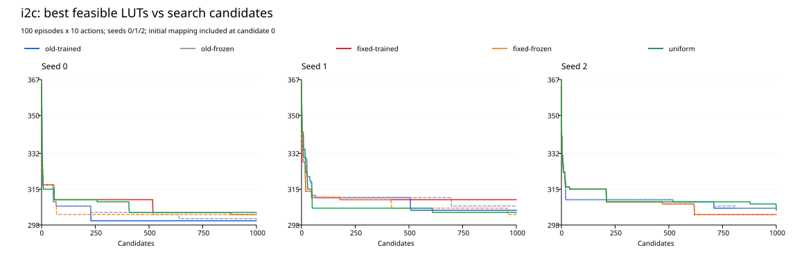

# 固定尺度状态归一化：i2c 消融实验报告

## Material Passport

- Origin Skill: academic-research-suite / experiment-agent
- Origin Mode: run + validate
- Origin Date: 2026-09-28
- Verification Status: VERIFIED（日志、预算、状态与导出网表核验；短程恢复回归）
- Version Label: fixed_state_normalization_v1

## 主要结果

固定尺度归一化下，新训练的最佳可行 LUT 均值为 **305.333**，旧训练为 **303.667**。旧训练减新训练的平均差为 **-1.667 LUT**，逐种子差值为 [-3.0, -5.0, 3.0]，胜/平/负为 1/0/2。

未达到预定筛查标准：平均至少减少 1 LUT，且至少两个种子改善。本次没有确认值得继续投入的工程收益。

搜索中的学习收益（冻结减训练）：旧归一化 **1.000 LUT**，固定归一化 **-2.333 LUT**；学习收益变化为 **-3.333 LUT**，逐种子为 [-1.0, -9.0, 0.0]。输入表示效果与权重学习效果必须分别解释。

独立评估中，旧训练减新训练的平均差为 **0.067 LUT**；旧、新归一化的学习收益分别为 **0.456** 和 **-0.411 LUT**，学习收益变化为 **-0.867 LUT**。

三个种子仅支持探索性判断；固定模型评估的多条轨迹不能替代独立训练种子。

新冻结相对旧冻结平均少 1.667 LUT，但新训练未同步改善。表示变化对冻结搜索的帮助没有转化为本次训练搜索的工程收益。

## 设置与计分口径

仅改变状态归一化。i2c、种子 0/1/2、100 轮 × 10 步、LUT6、层数上限 4、初始 strash、七个动作、九维输入。网络、Adam、γ=0.99、原奖励及逐轮回报标准化保持不变。

六个计数特征按 x/max(|x₀|,1) 换算，三个门比例保留；x₀ 来自每轮初始 strash 后的原始状态，参考分母不随轨迹变化。训练、诊断与推理使用相同实现。

原版训练、冻结、均匀随机的九次搜索复用 learning-effectiveness 的完整证据。其源码按基准提交核验，工具/电路/环境一致，45 个 i2c 模型相关文件哈希匹配；复用来源见 experiment.json、historical-inputs.json。旧结果未重跑，也不称为本次独立重复。

新增六次搜索共 6,000 候选，历史对照共 9,000 候选；初始映射可选优但不计入动作候选。每种归一化的训练/冻结使用同初始权重和采样 RNG，第一轮一致；两种归一化之间允许动作不同。

固定第 100 轮模型，用 30000–30029 评估种子，各跑 30 条无更新十步轨迹，取每条轨迹含起点的最佳可行 LUT。四类网络策略各三个模型；均匀随机仅跑一组并共享。390 条实际轨迹、3,900 候选，与训练预算分开；评估不会把偶然更优网表追加到训练成绩。

## 训练搜索结果

| 组别 | seed 0 | seed 1 | seed 2 | 均值 ± 总体标准差 | 来源 |
|---|---:|---:|---:|---:|---|
| 旧训练 | 300 | 305 | 306 | 303.667 ± 2.625 | 历史复用 |
| 旧冻结 | 301 | 307 | 306 | 304.667 ± 2.625 | 历史复用 |
| 新训练 | 303 | 310 | 303 | 305.333 ± 3.300 | 新增 |
| 新冻结 | 303 | 303 | 303 | 303.000 ± 0.000 | 新增 |
| 均匀随机 | 304 | 304 | 305 | 304.333 ± 0.471 | 历史复用 |

| 比较（正值表示改善） | 逐种子差值 | 平均差 | 胜/平/负 |
|---|---|---:|---|
| 旧训练减新训练 | [-3.0, -5.0, 3.0] | -1.667 | 1/0/2 |
| 旧冻结减旧训练 | [1.0, 2.0, 0.0] | 1.000 | 2/1/0 |
| 新冻结减新训练 | [0.0, -7.0, 0.0] | -2.333 | 0/2/1 |
| 新学习收益减旧学习收益 | [-1.0, -9.0, 0.0] | -3.333 | 0/1/2 |
| 均匀随机减旧训练 | [4.0, -1.0, -1.0] | 0.667 | 1/0/2 |
| 均匀随机减新训练 | [1.0, -6.0, 2.0] | -1.000 | 2/0/1 |



## 固定模型独立评估

| 组别 | 训练种子 | 最佳可行 LUT 均值 | 可行轨迹 | 终点 LUT 均值 | 终点层数均值 |
|---|---:|---:|---|---:|---:|
| 旧训练 | 0 | 315.867 | 30/30 | 316.533 | 4.000 |
| 旧训练 | 1 | 325.300 | 30/30 | 326.700 | 3.967 |
| 旧训练 | 2 | 318.633 | 30/30 | 319.267 | 4.000 |
| 旧冻结 | 0 | 316.800 | 30/30 | 317.433 | 4.000 |
| 旧冻结 | 1 | 324.933 | 30/30 | 326.133 | 4.000 |
| 旧冻结 | 2 | 319.433 | 30/30 | 320.600 | 3.967 |
| 新训练 | 0 | 317.233 | 30/30 | 318.067 | 4.000 |
| 新训练 | 1 | 323.600 | 30/30 | 325.067 | 4.000 |
| 新训练 | 2 | 318.767 | 30/30 | 319.200 | 4.000 |
| 新冻结 | 0 | 317.200 | 30/30 | 318.200 | 4.000 |
| 新冻结 | 1 | 322.433 | 30/30 | 324.500 | 3.967 |
| 新冻结 | 2 | 318.733 | 30/30 | 319.167 | 4.000 |
| 均匀随机 | 共享 | 318.433 | 30/30 | 318.733 | 4.000 |

| 比较 | 三个模型的配对差值 | 平均差 |
|---|---|---:|
| 旧训练减新训练 | [-1.367, 1.7, -0.133] | 0.067 |
| 旧冻结减旧训练 | [0.933, -0.367, 0.8] | 0.456 |
| 新冻结减新训练 | [-0.033, -1.167, -0.033] | -0.411 |
| 学习收益变化 | [-0.967, -0.8, -0.833] | -0.867 |

## 验证、耗时与限制

validation.json 逐步复算全部搜索和评估的奖励、归一化、最好值、动作与预算；核对同种子初始权重、首轮配对、冻结不变和 Actor/Critic 更新。netlist-validation.json 记录映射及未映射最佳网表的 CEC、指标及哈希。

测试覆盖原版路径的精确权重/Adam/RNG/动作回归、固定尺度的公式与特征顺序、零初始计数、路径无关性、生产/诊断一致性、真实工具断点恢复、非法续跑拒绝，以及推理不修改模型。短程恢复回归不等于全部长程搜索独立重跑。

| 组别 | 三次搜索耗时总和（秒） | 来源 |
|---|---:|---|
| 旧训练 | 520.316 | 历史运行 |
| 旧冻结 | 627.162 | 历史运行 |
| 新训练 | 446.371 | 本次运行 |
| 新冻结 | 465.955 | 本次运行 |
| 均匀随机 | 621.659 | 历史运行 |

train：6 个实际任务，累计子任务墙钟时间 927.019 秒；每个任务的命令、起止时间、退出码及超时记录见 train-provenance.json。

evaluate：13 个实际任务，累计子任务墙钟时间 678.604 秒；每个任务的命令、起止时间、退出码及超时记录见 evaluate-provenance.json。

三个并行进程，每进程一个 Torch 线程，单任务硬超时 30 分钟，失败不自动重复。各组并发共享机器，旧新运行时间也不同；耗时用于成本记录，不据此声称算法效率提高。

预定门槛为平均至少少 1 LUT 且至少两种子改善，未调参、未换种子、未选择中间模型。本实验止于 i2c 三种子；不做显著性宣称、不外推到其他电路。评估种子使用共同随机数，均匀随机共享结果不计为多个独立样本。

统计风险核查覆盖 11/11：辛普森悖论（不跨电路混合）、生态谬误（训练种子为独立单位）、选择偏差和碰撞变量（不筛成功结果）、基率忽略（报告全部可行率）、回归均值（固定种子与对照）、幸存者偏差（保留失败）、多重搜索和分析分叉（固定公式/门槛/最终模型，不作显著性选择）、相关当因果和反向因果（分开工程收益与训练减冻结收益）。

## 交付与重放

代码、协议、CSV、汇总、图表、测试及验证记录随分支交付；evidence.tar.gz 含日志、初始/最终权重、最佳网表及 SHA256.json。完整本机输出位于 results/fixed-state-normalization/；历史输入保持哈希不变。artifact-manifest.json 记录交付文件哈希和源码指纹。AI 用于实现、核验、分析与报告撰写。

在仓库根目录运行（已有完整结果不可覆盖）：

```bash
.tools/conda-env/bin/python -B experiments/fixed-state-normalization/check.py
.tools/conda-env/bin/python -B -u experiments/fixed-state-normalization/run.py all --plot-python /你的绘图Python路径
# 仅在中断后显式续跑，源码/协议/工具必须保持一致
.tools/conda-env/bin/python -B -u experiments/fixed-state-normalization/run.py train --resume
.tools/conda-env/bin/python -B -u experiments/fixed-state-normalization/run.py evaluate --resume
# 分析已有数据，不重复搜索
.tools/conda-env/bin/python -B experiments/fixed-state-normalization/run.py analyze
```

绘图 Python 需要 ReportLab 与 PyMuPDF；本次使用 Codex 内置文档运行环境，不修改训练依赖。实际绘图命令及输出哈希见 plot-validation.json。

更新交付文档后，使用 `sh experiments/fixed-state-normalization/package.sh` 重新生成证据包与交付哈希。该入口备份旧的生成清单，避免清单包含自身；重复打包的一次失败记录保留在 `package-failure.json`，不计作训练或评估失败。
