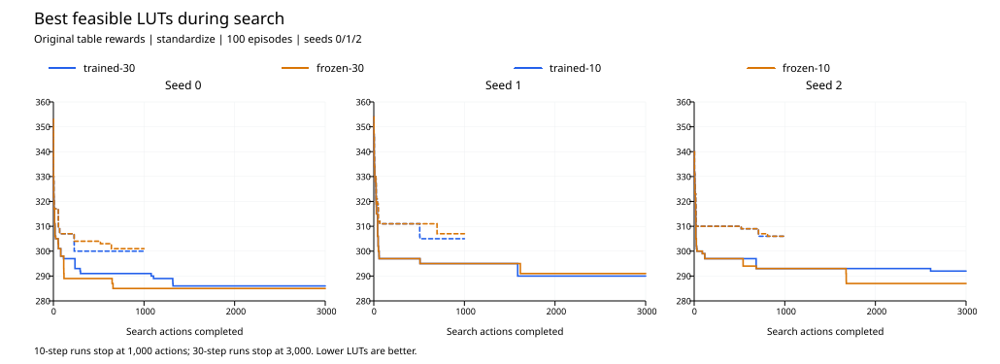

# 原始奖励下的学习收益：10 步与 30 步

固定 i2c、层数上限 4、种子 0/1/2、100 轮。所有组使用原始离散奖励表与 standardize 回报处理。
10 步训练复用修改奖励前的完整结果，其余九次运行从头初始化；每种子的搜索预算由 1,000 增至 3,000 个动作。

| 组别 | seed 0 | seed 1 | seed 2 | 最好可行 LUT 均值 ± 总体标准差 |
|---|---:|---:|---:|---:|
| trained-10 | 300 | 305 | 306 | 303.667 ± 2.625 |
| frozen-10 | 301 | 307 | 306 | 304.667 ± 2.625 |
| trained-30 | 286 | 290 | 292 | 289.333 ± 2.494 |
| frozen-30 | 285 | 291 | 287 | 287.667 ± 2.494 |

| 对照 | 逐种子 LUT 减少量 | 平均减少 LUT | 胜/平/负 |
|---|---|---:|---:|
| learning_10 | [1, 2, 0] | +1.000 | 2/1/0 |
| learning_30 | [-1, 1, -5] | -1.667 | 1/0/2 |
| longer_trained | [14, 15, 14] | +14.333 | 3/0/0 |
| longer_frozen | [16, 16, 19] | +17.000 | 3/0/0 |

减少量为 baseline LUT 减 treatment LUT。learning 对照的 baseline 是同长度冻结组，正值表示训练更好；longer 对照的 baseline 是 10 步组。

## 结果解读

原始奖励在 10 步下，学习平均减少 +1.000 LUT（+0.328%）；30 步下平均减少 -1.667 LUT（-0.579%）。
30 步训练组反而比同预算冻结组平均多 1.667 LUT，延长序列没有体现出额外学习收益。
延长后的学习收益变化为 [-2, -1, -5]，均值 -2.667 LUT。三种子结果只能作为本电路与固定预算下的描述性证据。
10 步冻结组的全部动作、LUT 和层数与上一轮冻结组一致，确认奖励和回报处理不会影响不更新网络的策略采样。
跨长度改善同时包含更长序列、三倍动作预算，以及更长回报序列和损失求和的影响。不能将跨长度改善直接归因于强化学习。
冻结策略为按状态输出动作概率的初始随机网络。没有载入已训练权重，也不是均匀随机搜索。

## 训练行为

| 组别 | 最后 20 轮终点 LUT 均值 | 终点可行率 | 不可行动作 / 总动作 | 相对同长度冻结组不同动作 | actor / critic 参数变化 RMS |
|---|---:|---:|---:|---:|---:|
| trained-10 | 321.367 | 100.00% | 0/3000 | 173 | 0.008605 / 0.029150 |
| frozen-10 | 321.900 | 100.00% | 0/3000 | 0 | 0.000000 / 0.000000 |
| trained-30 | 304.667 | 100.00% | 0/9000 | 590 | 0.009515 / 0.029359 |
| frozen-30 | 305.333 | 100.00% | 0/9000 | 0 | 0.000000 / 0.000000 |

逐轮终点指标为训练诊断；主指标仍为固定预算内遇到的最好可行 LUT。
trajectories.csv.gz 保存全部 24,000 个动作后的最好值与指标；episodes.csv 保存每轮终点、原始／处理后回报尺度与动作差异。

冻结组的处理后回报按配置离线重算用于核验，不用于网络更新。



## 验证与来源

- 31 项测试通过，无跳过；包含与 adf7bef 原奖励及标准化回报／网络更新的精确一致性检查，以及三组真实工具续跑一致性。
- 12 次新旧运行的 24,000 个动作奖励、每轮奖励和、检查点、日志最优解及导出内容核验通过；12 个最优网表重新通过 LUT、层数和 ABC CEC 检查。
- 同种子所有新组初始网络、Adam、RNG 相同；训练／冻结第一轮一致，30 步第一轮前 10 步与历史一致。
- 冻结组逐轮检查 actor、critic 和 Adam 不变，采样 RNG 正常推进；10 步冻结组最终状态亦与上一轮冻结组一致。
- 原始训练源码和结果由历史清单及已提交证据哈希验证；旧结果未改写。当前工具二进制与最近两轮相同，原始历史训练清单未记录工具版本。
- provenance.json、三个 YAML：命令、时间、配置指纹、来源哈希和环境；validation.json、tests.log、test-results.json、cec/：验证证据。
- comparison.json / comparison.csv：逐种子结果与预定对照；step-logs.tar.gz：全部逐步日志、结果、最优映射网表及原 CEC，含 SHA256.json 并已读回核验。
- best-trajectories.svg / .png：用 ReportLab 绘制的逐种子轨迹；plot-validation.json 记录绘图命令、环境与数据／输出哈希。
- 完整模型、初始权重快照和原始输出保存在 results/i2c-learning-horizon/。

## 复现

```bash
.tools/conda-env/bin/python -B -m unittest discover -s tests -v
.tools/conda-env/bin/python -B -u experiments/i2c-learning-horizon/run.py
# 中断后使用相同组、配置、源码续跑
.tools/conda-env/bin/python -B -u experiments/i2c-learning-horizon/run.py --resume
.tools/conda-env/bin/python -B experiments/i2c-learning-horizon/evaluate.py
```

首次运行要求新输出目录不存在；已有本次完整结果时仅运行 evaluate.py 复核。未根据结果改变种子、步数或轮数。
绘图另运行 plot.py，使用 Codex 自带的 ReportLab 环境；实际 Python 路径与完整命令记录于 plot-validation.json。
