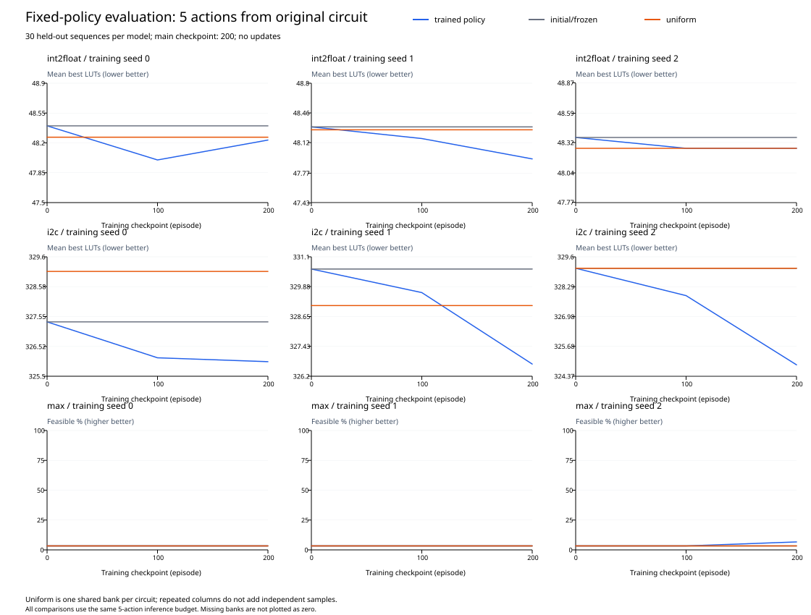
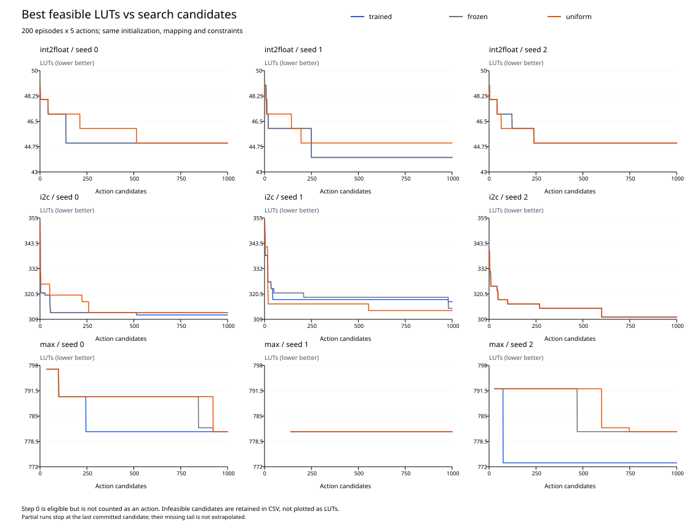

# DRiLLS 200轮 × 5步：学习有效性实验报告

## Material Passport

- Origin Skill: academic-research-suite / experiment-agent
- Origin Mode: run + validate
- Origin Date: 2026-09-27
- Verification Status: VERIFIED（短程原实现一致性、断点恢复及完整日志/网表复核）
- Version Label: learning_effectiveness_200x5_v1

## 主要结论

训练完成 27/27 次；独立评估完成 900/900 条实际序列，30/30 个实际评估bank。

**int2float：存在局部改善，未验证对两种基线的稳定收益。**
第200轮相对初始化/冻结平均减少 0.211 LUT，探索性95%区间 [-0.044, 0.489]；逐训练种子减少量 [0.167, 0.367, 0.1]。
第200轮相对均匀随机平均减少 0.122 LUT，探索性95%区间 [-0.122, 0.411]；逐训练种子减少量 [0.033, 0.333, 0.0]。

**i2c：本设置下观察到一致收益。**
第200轮相对初始化/冻结平均减少 3.167 LUT，探索性95%区间 [1.067, 5.644]；逐训练种子减少量 [1.367, 3.9, 4.233]。
第200轮相对均匀随机平均减少 3.244 LUT，探索性95%区间 [0.667, 5.844]；逐训练种子减少量 [3.1, 2.4, 4.233]。

**max：存在局部改善，未验证对两种基线的稳定收益。**
第200轮可行 4/90，初始化/冻结可行 3/90；可行率变化 1.111 个百分点，探索性95%区间 [0.000, 6.667]。存在不可行序列，不汇总筛选后的LUT收益。
第200轮可行 4/90，均匀随机可行 3/90；可行率变化 1.111 个百分点，探索性95%区间 [0.000, 6.667]。存在不可行序列，不汇总筛选后的LUT收益。

训练组Actor/Critic均改变 9/9 次；固定探针动作分布改变 9/9 次；冻结及uniform参数保持不变 18/18 次。参数变化本身不作为搜索收益证据。

本实验检验200×5设置下的策略收益。相对100×10，它同时缩短序列并增加更新次数；相对50×50还减少了动作预算。无论结果是否改善，都不能据此单独证明“原先步数太多掩盖优势”。

## 条件与统计口径

三组trained/frozen/uniform，训练种子0/1/2，每次200轮×5步；LUT6，int2float/i2c/max最大层数3/4/41。学习率0.001、原奖励、网络、Adam、折扣因子、状态及回报归一化均保持原设置。trained每轮更新一次；frozen及uniform停止更新。

保存第0/100/200轮模型，第200轮是预定主结果，第100轮仅观察学习过程。各模型使用20000–20029评估种子，每条5步序列重新从原电路开始，全程无更新。初始映射允许成为最优解，但不计入动作候选。冻结经不变性验证后共享初始化评估。

900条实际序列组成30个bank：3电路×3训练种子×3检查点，加每电路一个uniform bank。uniform在配对CSV中共享给三个训练种子，形成1,080条逻辑行；这些重复行不增加独立样本量。

排序为可行优先；可行时先LUT再层数，不可行时先层数再LUT。只要配对含不可行序列，就报告完整可行率和可行优先胜/平/负，不计算筛选后的LUT平均收益。终点LUT、层数和奖励为辅助指标。0/0表示缺失，不表示0%可行。

六个主比较使用配对分层bootstrap，先重采样训练种子，再共同重采样评估种子列，保留共同随机数及uniform共享bank的相关性。10,000次，统计种子20260927。只有3次独立训练，区间是探索性估计，不把90条配对序列当作90次独立训练，不宣称统计等效。

预定结论规则：某电路对两基线的主指标区间下界均大于零，且三个训练种子均朝改善方向，才表述为“本设置下观察到一致收益”。混合可行情况下主指标是可行率；全可行情况下为LUT减少量。未规定实用收益门槛，也未进行多重比较校正；上述规则仅用于本实验的探索性描述。

## 第200轮独立策略主比较

| 电路 | 基线 | LUT减少量 | 探索性95%区间 | 可行率变化/百分点及区间 | 可行优先胜/平/负 |
|---|---|---:|---|---|---|
| int2float | initial | 0.211 | [-0.044, 0.489] | 0.000 / [0.000, 0.000] | 17/67/6 |
| int2float | uniform | 0.122 | [-0.122, 0.411] | 0.000 / [0.000, 0.000] | 16/65/9 |
| i2c | initial | 3.167 | [1.067, 5.644] | 0.000 / [0.000, 0.000] | 36/45/9 |
| i2c | uniform | 3.244 | [0.667, 5.844] | 0.000 / [0.000, 0.000] | 40/37/13 |
| max | initial | 未汇总 | 未汇总 | 1.111 / [0.000, 6.667] | 23/56/11 |
| max | uniform | 未汇总 | 未汇总 | 1.111 / [0.000, 6.667] | 27/57/6 |

正值表示训练更好。逐种子效应、可行数量和配对结果见comparisons.csv；逐条数据见evaluation.csv。

## 初始化、中期与最终模型

| 电路 | 训练seed | 策略 | 完成/30 | 最佳解可行/30 | 最佳LUT均值 | 终点可行/30 | 终点LUT均值 | 终点层数均值 | 奖励和均值 |
|---|---:|---|---:|---:|---:|---:|---:|---:|---:|
| int2float | 0 | initial | 30/30 | 30/30 | 48.400 | 25/30 | 未汇总 | 3.167 | 1.900 |
| int2float | 1 | initial | 30/30 | 30/30 | 48.300 | 29/30 | 未汇总 | 3.033 | 2.067 |
| int2float | 2 | initial | 30/30 | 30/30 | 48.367 | 29/30 | 未汇总 | 3.033 | 2.433 |
| i2c | 0 | initial | 30/30 | 30/30 | 327.367 | 30/30 | 327.967 | 4.000 | 10.567 |
| i2c | 1 | initial | 30/30 | 30/30 | 330.600 | 30/30 | 331.700 | 4.000 | 8.867 |
| i2c | 2 | initial | 30/30 | 30/30 | 329.100 | 30/30 | 329.667 | 4.000 | 9.300 |
| max | 0 | initial | 30/30 | 1/30 | 未汇总 | 1/30 | 未汇总 | 45.267 | 2.233 |
| max | 1 | initial | 30/30 | 1/30 | 未汇总 | 1/30 | 未汇总 | 45.033 | 2.833 |
| max | 2 | initial | 30/30 | 1/30 | 未汇总 | 1/30 | 未汇总 | 45.233 | 2.400 |
| int2float | 0 | trained-100 | 30/30 | 30/30 | 48.000 | 27/30 | 未汇总 | 3.100 | 2.767 |
| int2float | 1 | trained-100 | 30/30 | 30/30 | 48.167 | 29/30 | 未汇总 | 3.033 | 2.233 |
| int2float | 2 | trained-100 | 30/30 | 30/30 | 48.267 | 29/30 | 未汇总 | 3.033 | 2.367 |
| i2c | 0 | trained-100 | 30/30 | 30/30 | 326.133 | 30/30 | 326.700 | 4.000 | 10.867 |
| i2c | 1 | trained-100 | 30/30 | 30/30 | 329.633 | 30/30 | 330.600 | 4.000 | 9.067 |
| i2c | 2 | trained-100 | 30/30 | 30/30 | 327.900 | 30/30 | 328.567 | 4.000 | 9.500 |
| max | 0 | trained-100 | 30/30 | 1/30 | 未汇总 | 1/30 | 未汇总 | 45.133 | 2.867 |
| max | 1 | trained-100 | 30/30 | 1/30 | 未汇总 | 1/30 | 未汇总 | 45.033 | 2.867 |
| max | 2 | trained-100 | 30/30 | 1/30 | 未汇总 | 1/30 | 未汇总 | 44.567 | 3.100 |
| int2float | 0 | trained-200 | 30/30 | 30/30 | 48.233 | 29/30 | 未汇总 | 3.033 | 2.600 |
| int2float | 1 | trained-200 | 30/30 | 30/30 | 47.933 | 30/30 | 48.567 | 3.000 | 2.500 |
| int2float | 2 | trained-200 | 30/30 | 30/30 | 48.267 | 29/30 | 未汇总 | 3.033 | 2.500 |
| i2c | 0 | trained-200 | 30/30 | 30/30 | 326.000 | 30/30 | 326.733 | 4.000 | 10.767 |
| i2c | 1 | trained-200 | 30/30 | 30/30 | 326.700 | 30/30 | 327.300 | 4.000 | 9.867 |
| i2c | 2 | trained-200 | 30/30 | 30/30 | 324.867 | 30/30 | 325.433 | 4.000 | 11.067 |
| max | 0 | trained-200 | 30/30 | 1/30 | 未汇总 | 1/30 | 未汇总 | 43.900 | 3.233 |
| max | 1 | trained-200 | 30/30 | 1/30 | 未汇总 | 1/30 | 未汇总 | 43.533 | 3.567 |
| max | 2 | trained-200 | 30/30 | 2/30 | 未汇总 | 2/30 | 未汇总 | 43.800 | 3.533 |
| int2float | 0 | uniform | 30/30 | 30/30 | 48.267 | 28/30 | 未汇总 | 3.067 | 2.467 |
| int2float | 1 | uniform | 30/30 | 30/30 | 48.267 | 28/30 | 未汇总 | 3.067 | 2.467 |
| int2float | 2 | uniform | 30/30 | 30/30 | 48.267 | 28/30 | 未汇总 | 3.067 | 2.467 |
| i2c | 0 | uniform | 30/30 | 30/30 | 329.100 | 30/30 | 329.633 | 4.000 | 9.333 |
| i2c | 1 | uniform | 30/30 | 30/30 | 329.100 | 30/30 | 329.633 | 4.000 | 9.333 |
| i2c | 2 | uniform | 30/30 | 30/30 | 329.100 | 30/30 | 329.633 | 4.000 | 9.333 |
| max | 0 | uniform | 30/30 | 1/30 | 未汇总 | 1/30 | 未汇总 | 45.700 | 2.433 |
| max | 1 | uniform | 30/30 | 1/30 | 未汇总 | 1/30 | 未汇总 | 45.700 | 2.433 |
| max | 2 | uniform | 30/30 | 1/30 | 未汇总 | 1/30 | 未汇总 | 45.700 | 2.433 |



## 训练期间搜索表现（辅助结果）

| 电路 | 组别 | seed | 状态 | 完成轮数 | 最佳LUT/层数/可行 | 首次最佳候选 | 候选可行率 |
|---|---|---:|---|---:|---|---:|---:|
| int2float | trained | 0 | complete | 200 | 45/3/True | 139 | 85.600% |
| int2float | trained | 1 | complete | 200 | 44/3/True | 250 | 94.300% |
| int2float | trained | 2 | complete | 200 | 45/3/True | 239 | 91.400% |
| i2c | trained | 0 | complete | 200 | 311/4/True | 515 | 100.000% |
| i2c | trained | 1 | complete | 200 | 317/4/True | 979 | 100.000% |
| i2c | trained | 2 | complete | 200 | 310/4/True | 600 | 100.000% |
| max | trained | 0 | complete | 200 | 781/41/True | 245 | 0.900% |
| max | trained | 1 | complete | 200 | 781/41/True | 140 | 0.800% |
| max | trained | 2 | complete | 200 | 773/41/True | 75 | 1.200% |
| int2float | frozen | 0 | complete | 200 | 45/3/True | 139 | 79.900% |
| int2float | frozen | 1 | complete | 200 | 44/3/True | 250 | 92.000% |
| int2float | frozen | 2 | complete | 200 | 45/3/True | 239 | 89.100% |
| i2c | frozen | 0 | complete | 200 | 312/4/True | 55 | 100.000% |
| i2c | frozen | 1 | complete | 200 | 314/4/True | 980 | 100.000% |
| i2c | frozen | 2 | complete | 200 | 310/4/True | 600 | 100.000% |
| max | frozen | 0 | complete | 200 | 781/41/True | 923 | 0.700% |
| max | frozen | 1 | complete | 200 | 781/41/True | 140 | 0.600% |
| max | frozen | 2 | complete | 200 | 781/41/True | 470 | 1.100% |
| int2float | uniform | 0 | complete | 200 | 45/3/True | 515 | 85.300% |
| int2float | uniform | 1 | complete | 200 | 45/3/True | 195 | 89.400% |
| int2float | uniform | 2 | complete | 200 | 45/3/True | 239 | 89.000% |
| i2c | uniform | 0 | complete | 200 | 312/4/True | 260 | 100.000% |
| i2c | uniform | 1 | complete | 200 | 313/4/True | 555 | 100.000% |
| i2c | uniform | 2 | complete | 200 | 310/4/True | 600 | 100.000% |
| max | uniform | 0 | complete | 200 | 781/41/True | 923 | 0.600% |
| max | uniform | 1 | complete | 200 | 781/41/True | 140 | 1.300% |
| max | uniform | 2 | complete | 200 | 781/41/True | 748 | 1.000% |



## 相同1,000候选预算的历史比较

| 电路 | 组别 | seed | 旧100×10 LUT/层数/可行 | 新200×5 LUT/层数/可行 |
|---|---|---:|---|---|
| int2float | trained | 0 | 45/3/True | 45/3/True |
| int2float | trained | 1 | 44/3/True | 44/3/True |
| int2float | trained | 2 | 43/3/True | 45/3/True |
| i2c | trained | 0 | 300/4/True | 311/4/True |
| i2c | trained | 1 | 305/4/True | 317/4/True |
| i2c | trained | 2 | 306/4/True | 310/4/True |
| max | trained | 0 | 769/41/True | 781/41/True |
| max | trained | 1 | 775/41/True | 781/41/True |
| max | trained | 2 | 773/41/True | 773/41/True |
| int2float | frozen | 0 | 44/3/True | 45/3/True |
| int2float | frozen | 1 | 44/3/True | 44/3/True |
| int2float | frozen | 2 | 43/3/True | 45/3/True |
| i2c | frozen | 0 | 301/4/True | 312/4/True |
| i2c | frozen | 1 | 307/4/True | 314/4/True |
| i2c | frozen | 2 | 306/4/True | 310/4/True |
| max | frozen | 0 | 763/41/True | 781/41/True |
| max | frozen | 1 | 775/41/True | 781/41/True |
| max | frozen | 2 | 773/41/True | 781/41/True |
| int2float | uniform | 0 | 44/3/True | 45/3/True |
| int2float | uniform | 1 | 44/3/True | 45/3/True |
| int2float | uniform | 2 | 44/3/True | 45/3/True |
| i2c | uniform | 0 | 304/4/True | 312/4/True |
| i2c | uniform | 1 | 304/4/True | 313/4/True |
| i2c | uniform | 2 | 305/4/True | 310/4/True |
| max | uniform | 0 | 769/41/True | 781/41/True |
| max | uniform | 1 | 778/41/True | 781/41/True |
| max | uniform | 2 | 777/41/True | 781/41/True |

历史数据只读，来源哈希见analysis-provenance.json。旧模型不参与新实验运行或独立评估。相同动作数不等于相同序列空间、更新次数或运行时间，历史差值不能单独归因于步数。

## 更新诊断、完成情况与限制

| 电路 | 组别 | seed | 保存轮次 | Actor漂移RMS | Critic漂移RMS | 探针KL | 熵 |
|---|---|---:|---:|---:|---:|---:|---:|
| int2float | trained | 0 | 200 | 0.018166 | 0.025891 | 0.058372 | 1.887486 |
| int2float | trained | 1 | 200 | 0.017446 | 0.030442 | 0.049914 | 1.813699 |
| int2float | trained | 2 | 200 | 0.018794 | 0.028550 | 0.027921 | 1.865733 |
| i2c | trained | 0 | 200 | 0.013590 | 0.054332 | 0.023878 | 1.840539 |
| i2c | trained | 1 | 200 | 0.018185 | 0.052034 | 0.091935 | 1.778057 |
| i2c | trained | 2 | 200 | 0.020898 | 0.056296 | 0.069369 | 1.844994 |
| max | trained | 0 | 200 | 0.025372 | 0.052304 | 0.048153 | 1.837235 |
| max | trained | 1 | 200 | 0.032420 | 0.062453 | 0.049797 | 1.891659 |
| max | trained | 2 | 200 | 0.034594 | 0.052962 | 0.211623 | 1.632817 |
| int2float | frozen | 0 | 200 | 0.000000 | 0.000000 | 0.000000 | 1.898945 |
| int2float | frozen | 1 | 200 | 0.000000 | 0.000000 | 0.000000 | 1.892641 |
| int2float | frozen | 2 | 200 | 0.000000 | 0.000000 | 0.000000 | 1.926004 |
| i2c | frozen | 0 | 200 | 0.000000 | 0.000000 | 0.000000 | 1.892439 |
| i2c | frozen | 1 | 200 | 0.000000 | 0.000000 | 0.000000 | 1.838814 |
| i2c | frozen | 2 | 200 | 0.000000 | 0.000000 | 0.000000 | 1.920864 |
| max | frozen | 0 | 200 | 0.000000 | 0.000000 | 0.000000 | 1.911237 |
| max | frozen | 1 | 200 | 0.000000 | 0.000000 | 0.000000 | 1.945910 |
| max | frozen | 2 | 200 | 0.000000 | 0.000000 | 0.000000 | 1.920189 |
| int2float | uniform | 0 | 200 | 0.000000 | 0.000000 | 0.000000 | 1.945910 |
| int2float | uniform | 1 | 200 | 0.000000 | 0.000000 | 0.000000 | 1.945910 |
| int2float | uniform | 2 | 200 | 0.000000 | 0.000000 | 0.000000 | 1.945910 |
| i2c | uniform | 0 | 200 | 0.000000 | 0.000000 | 0.000000 | 1.945910 |
| i2c | uniform | 1 | 200 | 0.000000 | 0.000000 | 0.000000 | 1.945910 |
| i2c | uniform | 2 | 200 | 0.000000 | 0.000000 | 0.000000 | 1.945910 |
| max | uniform | 0 | 200 | 0.000000 | 0.000000 | 0.000000 | 1.945910 |
| max | uniform | 1 | 200 | 0.000000 | 0.000000 | 0.000000 | 1.945910 |
| max | uniform | 2 | 200 | 0.000000 | 0.000000 | 0.000000 | 1.945910 |

探针固定为首轮归一化输入，诊断不消耗采样RNG；探针变化不能证明整个状态空间的策略质量。奖励与归一化机制本轮未干预，不将它们解释成已验证的收益原因。

已记录的执行任务无失败或超时；完整性以顶部完成数量及验证记录为准。

3个workers、每进程1个Torch线程，每分钟监控，单任务30分钟硬超时。耗时包含诊断开销与共享资源并发，仅按候选预算比较搜索质量，不据此给算法速度排名。

- training：37.465分钟；状态complete。
- evaluation：6.801分钟；状态complete。

只涉及三个训练电路及三个训练种子，不是未见电路泛化验证，也未证明5步或全局最优。核查了聚合反转、推断单位、选择/碰撞偏差、基率、回归均值、幸存者偏差、多重比较、分析分叉、相关当因果和反向因果共11类统计风险（11/11）；种子少、探索性区间及跨设置混杂仍限制结论。

## 验证、复现与代码交付

check.py保存5步原实现一致性、冻结、uniform、RNG隔离、断点恢复、快照、缺失和不可行处理测试，以及原回归测试。log-validation.json重放原始日志，核对27,000训练动作、奖励、最优值、可行率、4,500评估动作及评估模型哈希。

网表复核状态：complete；检查930份导出结果，通过1857个映射/未映射网表的CEC。详细命令、工具与网表哈希见netlist-validation.json。

完整训练每个种子只运行一次；短程精确回归、恢复测试和日志复核不等于所有完整实验都做了独立重复。源码、工具、输入及配置指纹见provenance.json，测试记录见test-results.json。

本套件代码、协议、CSV、图表、报告和evidence.tar.gz提交到本地learning-effectiveness分支。原始权重及完整运行输出位于results/learning-effectiveness-200x5/，不纳入Git；model-manifest.json记录每份权重哈希。其他机器固定模型重放需复制这些权重，或重新训练。

在仓库根目录执行，先按本机环境设置protocol.yml工具路径：

```bash
.tools/conda-env/bin/python -B experiments/learning-effectiveness-200x5/check.py
.tools/conda-env/bin/python -B -u experiments/learning-effectiveness-200x5/run.py
.tools/conda-env/bin/python -B -u experiments/learning-effectiveness-200x5/evaluate.py
.tools/conda-env/bin/python -B experiments/learning-effectiveness-200x5/verify.py
.tools/conda-env/bin/python -B experiments/learning-effectiveness-200x5/evaluate.py --report-only
# plot.py使用带ReportLab和PyMuPDF的Python环境；随后使用训练环境运行package.py
.tools/conda-env/bin/python -B experiments/learning-effectiveness-200x5/package.py
```

相同指纹中断续跑：run.py --resume / evaluate.py --resume。首次重跑使用干净结果目录，源码或协议变化后不能复用旧检查点。仅重新分析已有证据使用--report-only。本套件不依赖历史模型；历史CSV缺失时只省去历史比较。

AI用于实验代码实现、日志核对、统计、图表和报告撰写。
