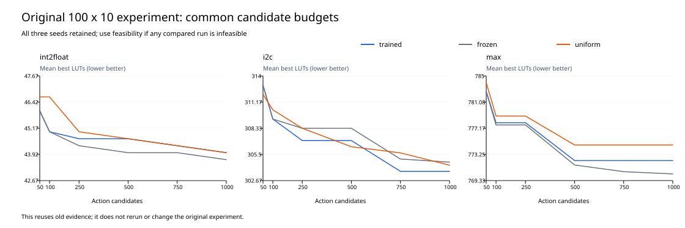
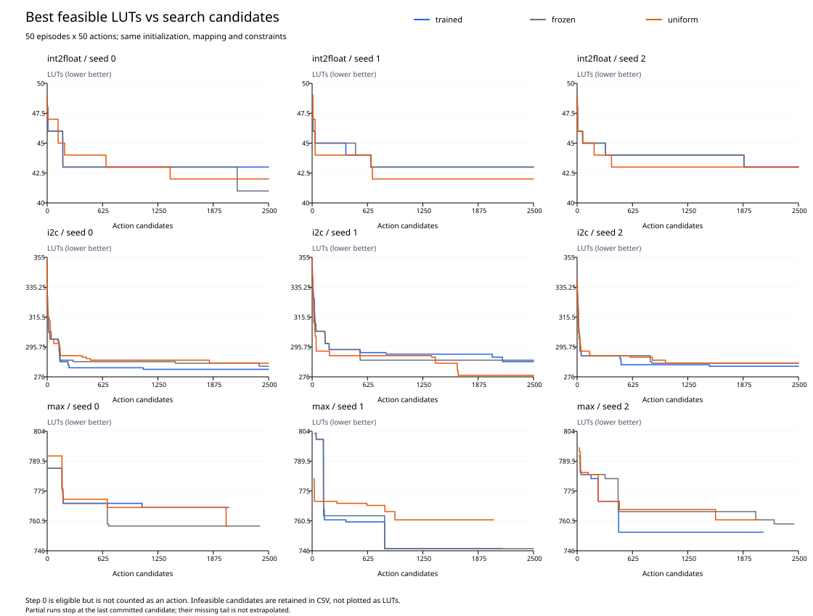
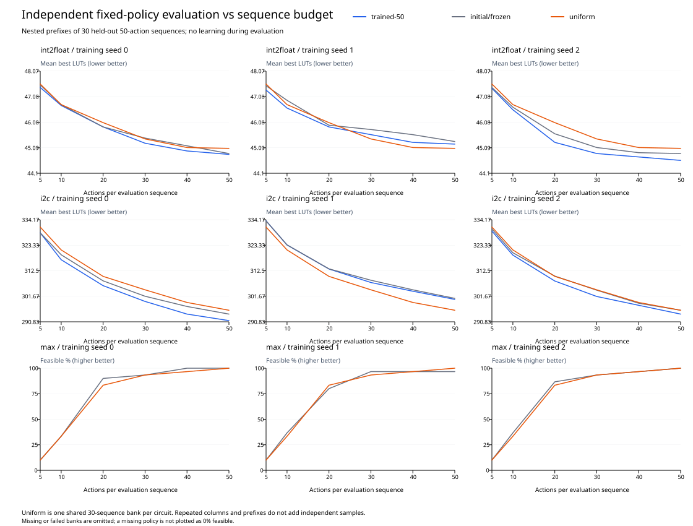

# DRiLLS 50轮 × 50步：学习收益与搜索预算报告

## Material Passport

- Origin Skill: academic-research-suite / experiment-agent
- Origin Mode: run + validate
- Origin Date: 2026-09-27
- Verification Status: INCOMPLETE
- Version Label: learning_effectiveness_50x50_v1

## 主要结论

训练搜索完成 19/27 次，物理独立评估完成 810/900 条，对应 990/1,080 条逻辑配对行（每个前缀）。

权重更新：训练组 9/9 次 Actor/Critic 均改变；固定探针动作分布 9/9 次改变；冻结及 uniform 18/18 次参数保持不变。使用每次运行最后已保存轮次，超时运行不能视为完成50轮。

旧int2float在50/100/250/500/750/1,000候选处，训练相对冻结平均少LUT为 0.000 / 0.000 / -0.333 / -0.667 / -0.333 / -0.333。

旧i2c在50/100/250/500/750/1,000候选处，训练相对冻结平均少LUT为 0.000 / 0.000 / 1.333 / 1.333 / 1.333 / 1.000。

旧max在50/100/250/500/750/1,000候选处，训练相对冻结平均少LUT为 0.000 / -0.333 / -0.333 / -0.667 / -1.667 / -2.000。

旧预算曲线未呈现三个电路一致的“训练早期领先、冻结随后追平”；个别预算或相对uniform的优势不足以单独支持探索预算抹平学习优势这一解释。

int2float：2,500 候选搜索中，训练相对冻结平均少 -0.667 LUT，逐种子差值 [-2, 0, 0]，胜/平/负 0/2/1。

i2c：2,500 候选搜索中，训练相对冻结平均少 1.667 LUT，逐种子差值 [2, 1, 2]，胜/平/负 3/0/0。

max：2,500候选预算未完整完成，不汇总完整预算搜索差值。

独立评估尚未全部完成；以下只判断已经完整完成的电路内主比较，缺失比较不作收益结论。

int2float：第50轮固定策略相对初始化/冻结平均减少 0.133 LUT，探索性95%区间 [-0.122, 0.400]。

int2float：第50轮固定策略相对uniform平均减少 0.178 LUT，探索性95%区间 [-0.367, 0.711]。

i2c：第50轮固定策略相对初始化/冻结平均减少 1.611 LUT，探索性95%区间 [0.067, 3.500]。

i2c：第50轮固定策略相对uniform平均减少 0.478 LUT，探索性95%区间 [-4.678, 5.000]。

max：第50轮主评估缺失或未完整完成，不以第25轮结果替代。

已完整评估的电路相对uniform的探索性区间均覆盖零；未获得稳定优于随机策略的证据，也不能据此证明策略等效。

缺失的第50轮模型限制了整体判断；不作三个电路整体学习收益的结论。

**50轮×50步同时增加搜索动作预算（1,000→2,500）、延长单条序列（10→50）、减少更新次数（100→50）。**回报标准化范围和求和损失长度也改变，因此跨设置的改善不能直接归因于学习。预算抹平假设由旧数据预算曲线单独检查；新实验回答长序列条件下固定训练策略是否优于初始化与随机策略。

## 运行完成情况与中断

| 阶段 | 任务 | 原因 | 退出码 | 耗时秒 |
|---|---|---|---:|---:|
| training | trained-max-0 | 30分钟硬超时 | -15 | 1800.1 |
| training | trained-max-1 | 30分钟硬超时 | -15 | 1800.1 |
| training | trained-max-2 | 30分钟硬超时 | -15 | 1800.1 |
| training | frozen-max-0 | 30分钟硬超时 | -15 | 1800.1 |
| training | frozen-max-2 | 30分钟硬超时 | -15 | 1800.2 |
| training | uniform-max-0 | 30分钟硬超时 | -15 | 1800.8 |
| training | uniform-max-1 | 30分钟硬超时 | -15 | 1800.8 |
| training | uniform-max-2 | 30分钟硬超时 | -15 | 1800.8 |
| evaluation | trained-50/max/seed-0 | Missing checkpoint | 未启动 | — |
| evaluation | trained-50/max/seed-1 | Missing checkpoint | 未启动 | — |
| evaluation | trained-50/max/seed-2 | Missing checkpoint | 未启动 | — |

部分运行保留已提交的完整轮次、诊断、模型和中断轮次原始文件；未完成运行不进入2,500候选的完整预算比较。缺失的第50轮模型不以中期模型替代。

## 条件和统计口径

三组 trained/frozen/uniform、种子0/1/2，每次 50轮×50步；int2float/i2c/max 的最大层数为3/4/41，LUT6。算法、奖励、episode_welford状态归一化、网络、Adam和学习率保持原设置。trained更新网络；frozen从初始化起保持Actor/Critic及Adam不变；uniform固定以1/7概率抽取七种动作。uniform训练种子控制随机动作，网络初始化不影响动作选择。

保存第0/10/25/50轮模型；独立评估预定使用第0/25/50轮，评估种子10000–10029。各序列重新从原电路开始，全程停止学习，前缀5/10/20/30/40/50步均来自同一条50步轨迹。初始映射也可成为最佳解，但不计入动作候选数。第一轮和初始状态公平性见validation.json。

物理评估有30个bank：3电路×3训练种子×3模型检查点，加3个uniform bank，共900条序列。uniform每个电路只执行一份30条基线；evaluation.csv为配对将其共享给三个训练种子，形成每前缀1,080行。共享行带physical_bank_id和shared_bank标记，不增加独立样本量。冻结通过不变性检查后共享初始化评估。

主指标为可行率和最佳可行LUT。任何配对存在不可行时，不使用筛除失败后的LUT均值；改报完整可行率和可行优先胜/平/负。排序为可行优先，可行时先LUT再层数，不可行时先层数再LUT。失败、未完成和未命中目标均保留。终点层数、LUT和奖励为辅助指标。

## 旧100×10数据：预算效应

| 电路 | 预算 | trained逐种子最佳LUT | frozen逐种子最佳LUT | uniform逐种子最佳LUT | 训练相对冻结平均减少LUT | 训练相对uniform平均减少LUT |
|---|---:|---|---|---|---:|---:|
| int2float | 50 | 46 / 46 / 46 | 46 / 46 / 46 | 47 / 47 / 46 | 0.000 | 0.667 |
| int2float | 100 | 45 / 44 / 46 | 45 / 44 / 46 | 47 / 47 / 46 | 0.000 | 1.667 |
| int2float | 250 | 45 / 44 / 45 | 45 / 44 / 44 | 46 / 45 / 44 | -0.333 | 0.333 |
| int2float | 500 | 45 / 44 / 45 | 45 / 44 / 43 | 45 / 45 / 44 | -0.667 | 0.000 |
| int2float | 750 | 45 / 44 / 44 | 45 / 44 / 43 | 44 / 45 / 44 | -0.333 | 0.000 |
| int2float | 1000 | 45 / 44 / 43 | 44 / 44 / 43 | 44 / 44 / 44 | -0.333 | 0.000 |
| i2c | 50 | 317 / 312 / 310 | 317 / 312 / 310 | 315 / 306 / 315 | 0.000 | -1.000 |
| i2c | 100 | 307 / 311 / 310 | 307 / 311 / 310 | 310 / 306 / 315 | 0.000 | 1.000 |
| i2c | 250 | 300 / 311 / 310 | 304 / 311 / 310 | 310 / 306 / 309 | 1.333 | 1.333 |
| i2c | 500 | 300 / 311 / 310 | 304 / 311 / 310 | 304 / 306 / 309 | 1.333 | -0.667 |
| i2c | 750 | 300 / 305 / 306 | 301 / 307 / 307 | 304 / 304 / 309 | 1.333 | 2.000 |
| i2c | 1000 | 300 / 305 / 306 | 301 / 307 / 306 | 304 / 304 / 305 | 1.000 | 0.667 |
| max | 50 | 786 / 785 / 777 | 786 / 785 / 777 | 792 / 783 / 777 | 0.000 | 1.333 |
| max | 100 | 786 / 775 / 773 | 781 / 775 / 777 | 777 / 783 / 777 | -0.333 | 1.000 |
| max | 250 | 786 / 775 / 773 | 781 / 775 / 777 | 777 / 783 / 777 | -0.333 | 1.000 |
| max | 500 | 769 / 775 / 773 | 763 / 775 / 777 | 769 / 778 / 777 | -0.667 | 2.333 |
| max | 750 | 769 / 775 / 773 | 763 / 775 / 774 | 769 / 778 / 777 | -1.667 | 2.333 |
| max | 1000 | 769 / 775 / 773 | 763 / 775 / 773 | 769 / 778 / 777 | -2.000 | 2.333 |

每格按seed0/1/2排列；“不可行”保留，不以其LUT混入可行均值。全部逐种子、可行标记和层数见old-budget.csv。预算效应应同时观察早期优势、对照随后追上和共同目标的首次候选数；单看最佳解出现轮次不足以判断。



| 设置 | 电路 | 目标LUT | 组别 | 命中/3 | 首次候选数seed0/1/2 |
|---|---|---:|---|---:|---|
| 100x10 | int2float | 48 (resyn2) | trained | 3/3 | 2 / 6 / 3 |
| 100x10 | int2float | 48 (resyn2) | frozen | 3/3 | 2 / 6 / 3 |
| 100x10 | int2float | 48 (resyn2) | uniform | 3/3 | 2 / 7 / 3 |
| 100x10 | int2float | 43 (old_best) | trained | 1/3 | 预算内未达到 / 预算内未达到 / 970 |
| 100x10 | int2float | 43 (old_best) | frozen | 1/3 | 预算内未达到 / 预算内未达到 / 470 |
| 100x10 | int2float | 43 (old_best) | uniform | 0/3 | 预算内未达到 / 预算内未达到 / 预算内未达到 |
| 100x10 | i2c | 322 (resyn2) | trained | 3/3 | 4 / 27 / 17 |
| 100x10 | i2c | 322 (resyn2) | frozen | 3/3 | 4 / 27 / 17 |
| 100x10 | i2c | 322 (resyn2) | uniform | 3/3 | 7 / 27 / 17 |
| 100x10 | i2c | 300 (old_best) | trained | 1/3 | 230 / 预算内未达到 / 预算内未达到 |
| 100x10 | i2c | 300 (old_best) | frozen | 0/3 | 预算内未达到 / 预算内未达到 / 预算内未达到 |
| 100x10 | i2c | 300 (old_best) | uniform | 0/3 | 预算内未达到 / 预算内未达到 / 预算内未达到 |
| 100x10 | max | 777 (resyn2) | trained | 3/3 | 280 / 70 / 29 |
| 100x10 | max | 777 (resyn2) | frozen | 3/3 | 280 / 70 / 29 |
| 100x10 | max | 777 (resyn2) | uniform | 2/3 | 100 / 预算内未达到 / 29 |
| 100x10 | max | 763 (old_best) | trained | 0/3 | 预算内未达到 / 预算内未达到 / 预算内未达到 |
| 100x10 | max | 763 (old_best) | frozen | 1/3 | 480 / 预算内未达到 / 预算内未达到 |
| 100x10 | max | 763 (old_best) | uniform | 0/3 | 预算内未达到 / 预算内未达到 / 预算内未达到 |
| 50x50 | int2float | 48 (resyn2) | trained | 3/3 | 2 / 6 / 3 |
| 50x50 | int2float | 48 (resyn2) | frozen | 3/3 | 2 / 6 / 3 |
| 50x50 | int2float | 48 (resyn2) | uniform | 3/3 | 2 / 7 / 3 |
| 50x50 | int2float | 43 (old_best) | trained | 3/3 | 177 / 665 / 1886 |
| 50x50 | int2float | 43 (old_best) | frozen | 3/3 | 177 / 665 / 1886 |
| 50x50 | int2float | 43 (old_best) | uniform | 3/3 | 665 / 665 / 389 |
| 50x50 | i2c | 322 (resyn2) | trained | 3/3 | 4 / 25 / 12 |
| 50x50 | i2c | 322 (resyn2) | frozen | 3/3 | 4 / 25 / 12 |
| 50x50 | i2c | 322 (resyn2) | uniform | 3/3 | 7 / 17 / 12 |
| 50x50 | i2c | 300 (old_best) | trained | 3/3 | 123 / 147 / 30 |
| 50x50 | i2c | 300 (old_best) | frozen | 3/3 | 123 / 147 / 30 |
| 50x50 | i2c | 300 (old_best) | uniform | 3/3 | 75 / 46 / 32 |
| 50x50 | max | 777 (resyn2) | trained | 3/3 | 168 / 129 / 239 |
| 50x50 | max | 777 (resyn2) | frozen | 3/3 | 168 / 128 / 463 |
| 50x50 | max | 777 (resyn2) | uniform | 3/3 | 168 / 25 / 239 |
| 50x50 | max | 763 (old_best) | trained | 2/3 | 未完成预算 / 138 / 470 |
| 50x50 | max | 763 (old_best) | frozen | 3/3 | 680 / 129 / 2018 |
| 50x50 | max | 763 (old_best) | uniform | 3/3 | 2021 / 935 / 1564 |

目标要求同时满足原层数限制；未命中记为预算内未达到，未完成记为未完成预算。不对成功样本单独算平均发现时间，不把未命中当作刚好在预算末尾命中。target-hits.csv保存全部108条记录。

## 新50×50搜索及27次运行的层数达标

| 电路 | 组别 | seed | 状态 | 最佳LUT/层数 | 动作候选达标 | 轮内有可行解 | 第50步达标 |
|---|---|---:|---|---|---|---|---|
| int2float | trained | 0 | complete | 43/3 | 2107/2500 (84.3%) | 50/50 (100.0%) | 41/50 (82.0%) |
| int2float | trained | 1 | complete | 43/3 | 2289/2500 (91.6%) | 50/50 (100.0%) | 45/50 (90.0%) |
| int2float | trained | 2 | complete | 43/3 | 2131/2500 (85.2%) | 50/50 (100.0%) | 45/50 (90.0%) |
| i2c | trained | 0 | complete | 281/4 | 2500/2500 (100.0%) | 50/50 (100.0%) | 50/50 (100.0%) |
| i2c | trained | 1 | complete | 286/4 | 2500/2500 (100.0%) | 50/50 (100.0%) | 50/50 (100.0%) |
| i2c | trained | 2 | complete | 283/4 | 2500/2500 (100.0%) | 50/50 (100.0%) | 50/50 (100.0%) |
| max | trained | 0 | timed_out | 767/41 | 1353/2050 (66.0%) | 39/41 (95.1%) | 39/41 (95.1%) |
| max | trained | 1 | timed_out | 747/41 | 1228/2150 (57.1%) | 40/43 (93.0%) | 39/43 (90.7%) |
| max | trained | 2 | timed_out | 755/41 | 1457/2100 (69.4%) | 42/42 (100.0%) | 42/42 (100.0%) |
| int2float | frozen | 0 | complete | 41/3 | 2060/2500 (82.4%) | 50/50 (100.0%) | 40/50 (80.0%) |
| int2float | frozen | 1 | complete | 43/3 | 2308/2500 (92.3%) | 50/50 (100.0%) | 47/50 (94.0%) |
| int2float | frozen | 2 | complete | 43/3 | 2130/2500 (85.2%) | 50/50 (100.0%) | 43/50 (86.0%) |
| i2c | frozen | 0 | complete | 283/4 | 2500/2500 (100.0%) | 50/50 (100.0%) | 50/50 (100.0%) |
| i2c | frozen | 1 | complete | 287/4 | 2500/2500 (100.0%) | 50/50 (100.0%) | 50/50 (100.0%) |
| i2c | frozen | 2 | complete | 285/4 | 2500/2500 (100.0%) | 50/50 (100.0%) | 50/50 (100.0%) |
| max | frozen | 0 | timed_out | 758/39 | 1529/2400 (63.7%) | 46/48 (95.8%) | 45/48 (93.8%) |
| max | frozen | 1 | complete | 747/41 | 1367/2500 (54.7%) | 45/50 (90.0%) | 44/50 (88.0%) |
| max | frozen | 2 | timed_out | 759/40 | 1716/2450 (70.0%) | 49/49 (100.0%) | 49/49 (100.0%) |
| int2float | uniform | 0 | complete | 42/3 | 2133/2500 (85.3%) | 50/50 (100.0%) | 45/50 (90.0%) |
| int2float | uniform | 1 | complete | 42/3 | 2165/2500 (86.6%) | 50/50 (100.0%) | 47/50 (94.0%) |
| int2float | uniform | 2 | complete | 43/3 | 2063/2500 (82.5%) | 50/50 (100.0%) | 44/50 (88.0%) |
| i2c | uniform | 0 | complete | 285/4 | 2500/2500 (100.0%) | 50/50 (100.0%) | 50/50 (100.0%) |
| i2c | uniform | 1 | complete | 277/4 | 2500/2500 (100.0%) | 50/50 (100.0%) | 50/50 (100.0%) |
| i2c | uniform | 2 | complete | 285/4 | 2500/2500 (100.0%) | 50/50 (100.0%) | 50/50 (100.0%) |
| max | uniform | 0 | timed_out | 758/40 | 1204/2050 (58.7%) | 39/41 (95.1%) | 39/41 (95.1%) |
| max | uniform | 1 | timed_out | 761/41 | 1223/2050 (59.7%) | 39/41 (95.1%) | 39/41 (95.1%) |
| max | uniform | 2 | timed_out | 761/41 | 1291/2050 (63.0%) | 40/41 (97.6%) | 40/41 (97.6%) |

“轮内有可行解”包含初始映射；候选达标仅统计50个动作后的状态。搜索允许中间超限，超限结果不会作为可行解比较最佳LUT。

| 电路 | 组别 | seed | 最佳LUT | 首次最佳轮次 | 轮内步数 | 累计动作候选 | 最佳动作序列 |
|---|---|---:|---:|---:|---:|---:|---|
| int2float | trained | 0 | 43 | 4 | 27 | 177 | strash → rewrite → balance → resub → resub -z → refactor -z → resub → rewrite → resub → rewrite -z → resub → balance → rewrite -z → refactor -z → rewrite -z → resub → rewrite → refactor -z → balance → resub → resub → resub → rewrite → refactor → resub → refactor → refactor -z → refactor -z |
| int2float | trained | 1 | 43 | 14 | 15 | 665 | strash → refactor → rewrite → balance → refactor -z → refactor → refactor → rewrite -z → refactor -z → rewrite → rewrite → refactor -z → resub → resub → rewrite → balance |
| int2float | trained | 2 | 43 | 38 | 36 | 1886 | strash → refactor → resub → rewrite -z → rewrite -z → resub -z → rewrite -z → rewrite -z → resub -z → resub -z → rewrite -z → resub -z → balance → balance → rewrite -z → balance → rewrite → rewrite -z → rewrite -z → rewrite -z → resub → rewrite -z → resub -z → balance → balance → balance → refactor → rewrite → resub → refactor -z → resub -z → rewrite -z → balance → rewrite -z → resub -z → resub → balance |
| i2c | trained | 0 | 281 | 22 | 34 | 1084 | strash → refactor → rewrite -z → balance → resub → resub → rewrite → refactor → rewrite → refactor → resub → resub → refactor → rewrite -z → rewrite -z → rewrite → balance → rewrite -z → rewrite -z → refactor → rewrite -z → refactor -z → rewrite -z → rewrite -z → balance → rewrite → balance → refactor -z → rewrite -z → refactor → refactor → refactor → rewrite -z → refactor -z → rewrite -z |
| i2c | trained | 1 | 286 | 43 | 50 | 2150 | strash → refactor → rewrite → rewrite -z → refactor → balance → refactor -z → resub → refactor → rewrite → balance → refactor → rewrite -z → rewrite → refactor -z → rewrite → rewrite → rewrite → rewrite -z → refactor → refactor → rewrite -z → rewrite → balance → balance → resub → refactor → balance → balance → balance → balance → balance → refactor -z → refactor -z → refactor -z → rewrite → resub → resub → refactor → refactor → refactor → refactor -z → refactor → balance → refactor → resub -z → rewrite → rewrite -z → resub → resub → balance |
| i2c | trained | 2 | 283 | 30 | 44 | 1494 | strash → rewrite -z → rewrite -z → rewrite -z → balance → rewrite -z → resub → rewrite → refactor -z → balance → rewrite → balance → resub -z → rewrite -z → rewrite → refactor -z → refactor → balance → refactor -z → rewrite -z → refactor -z → refactor -z → rewrite → balance → balance → rewrite -z → resub -z → resub -z → resub -z → resub -z → rewrite -z → rewrite → balance → rewrite -z → resub -z → refactor -z → rewrite → resub → refactor -z → resub -z → resub → balance → rewrite -z → balance → rewrite |
| max | trained | 0 | 767 | 22 | 22 | 1072 | strash → refactor → rewrite -z → balance → resub → resub → rewrite → refactor → rewrite → refactor → resub → refactor -z → refactor → balance → rewrite → rewrite → balance → rewrite -z → rewrite -z → refactor → rewrite -z → refactor -z → rewrite -z |
| max | trained | 1 | 747 | 17 | 19 | 819 | strash → refactor → balance → rewrite → resub → rewrite -z → rewrite → balance → rewrite -z → resub -z → resub → balance → refactor → balance → refactor -z → balance → balance → resub → resub → rewrite -z |
| max | trained | 2 | 755 | 10 | 20 | 470 | strash → rewrite -z → resub → balance → resub → refactor -z → rewrite → balance → balance → resub → resub → resub -z → rewrite -z → balance → balance → resub -z → refactor -z → rewrite -z → rewrite → resub -z → rewrite -z |
| int2float | frozen | 0 | 41 | 43 | 46 | 2146 | strash → refactor → refactor -z → resub → refactor -z → resub → rewrite -z → resub → balance → rewrite → refactor -z → rewrite -z → resub -z → rewrite -z → refactor -z → resub → rewrite → rewrite → resub → refactor -z → rewrite -z → balance → rewrite -z → rewrite -z → balance → rewrite -z → refactor → refactor -z → balance → rewrite → resub -z → balance → rewrite -z → rewrite → rewrite → balance → refactor → resub -z → rewrite → rewrite → refactor -z → refactor -z → rewrite → resub → rewrite → resub -z → balance |
| int2float | frozen | 1 | 43 | 14 | 15 | 665 | strash → refactor → rewrite → balance → refactor -z → refactor → refactor → rewrite -z → refactor -z → rewrite → refactor → refactor -z → resub → resub → rewrite → balance |
| int2float | frozen | 2 | 43 | 38 | 36 | 1886 | strash → refactor → resub → rewrite -z → rewrite -z → refactor → rewrite -z → rewrite -z → resub -z → resub -z → rewrite -z → resub -z → refactor → balance → rewrite -z → balance → rewrite → rewrite -z → rewrite -z → rewrite -z → resub → rewrite -z → resub -z → resub → balance → balance → refactor → rewrite → resub → refactor -z → resub -z → rewrite -z → balance → rewrite -z → resub -z → resub → balance |
| i2c | frozen | 0 | 283 | 48 | 44 | 2394 | strash → rewrite → rewrite -z → rewrite → refactor → balance → refactor -z → refactor -z → refactor → refactor -z → balance → balance → rewrite -z → resub → rewrite → refactor → resub → refactor -z → resub -z → resub → resub → refactor → rewrite -z → refactor -z → rewrite -z → resub → resub → rewrite -z → balance → refactor -z → rewrite → rewrite → resub → rewrite → refactor -z → refactor -z → balance → balance → balance → rewrite -z → refactor → refactor -z → rewrite -z → balance → refactor -z |
| i2c | frozen | 1 | 287 | 11 | 43 | 543 | strash → rewrite -z → resub → refactor -z → rewrite → refactor -z → refactor -z → resub → refactor → rewrite → refactor -z → rewrite → balance → balance → rewrite -z → rewrite → refactor -z → resub -z → rewrite -z → balance → resub → refactor → balance → refactor → refactor -z → refactor → rewrite → refactor → balance → resub → rewrite -z → refactor → balance → balance → balance → rewrite -z → refactor -z → refactor -z → balance → balance → resub → refactor -z → refactor → rewrite |
| i2c | frozen | 2 | 285 | 17 | 43 | 843 | strash → rewrite -z → balance → resub -z → refactor -z → rewrite -z → rewrite → rewrite -z → resub → rewrite -z → resub -z → refactor -z → refactor -z → rewrite -z → refactor -z → refactor -z → resub -z → resub → rewrite → refactor -z → rewrite -z → resub -z → rewrite → refactor -z → resub -z → refactor -z → resub → resub -z → balance → resub → resub → rewrite -z → balance → rewrite → balance → resub -z → resub -z → resub → refactor → resub -z → rewrite -z → resub → balance → refactor -z |
| max | frozen | 0 | 758 | 14 | 44 | 694 | strash → resub → refactor → resub → rewrite -z → resub -z → resub -z → resub → balance → resub → balance → resub -z → balance → refactor → refactor -z → balance → resub → rewrite → refactor -z → rewrite -z → balance → refactor → resub → rewrite -z → rewrite -z → rewrite -z → rewrite → balance → refactor -z → balance → rewrite -z → refactor -z → rewrite → rewrite → resub → resub -z → refactor → rewrite -z → refactor → balance → rewrite → refactor -z → balance → rewrite → rewrite -z |
| max | frozen | 1 | 747 | 17 | 19 | 819 | strash → refactor → balance → rewrite → resub → rewrite -z → rewrite → balance → rewrite -z → resub -z → resub → balance → refactor → balance → refactor -z → balance → balance → resub → resub → rewrite -z |
| max | frozen | 2 | 759 | 45 | 26 | 2226 | strash → resub -z → resub -z → rewrite → rewrite -z → resub -z → rewrite -z → balance → rewrite -z → rewrite → refactor → refactor -z → balance → refactor -z → refactor -z → refactor -z → balance → resub → rewrite → refactor -z → balance → resub → resub → resub -z → refactor -z → refactor → rewrite -z |
| int2float | uniform | 0 | 42 | 28 | 39 | 1389 | strash → refactor -z → balance → refactor -z → refactor → rewrite → balance → rewrite → refactor -z → resub → resub → resub -z → rewrite → refactor → resub → resub → resub -z → resub → resub -z → resub → refactor → refactor → resub -z → resub -z → resub -z → rewrite -z → resub → rewrite → resub -z → resub → rewrite -z → refactor -z → refactor → rewrite → resub -z → rewrite -z → rewrite → rewrite -z → balance → refactor -z |
| int2float | uniform | 1 | 42 | 14 | 31 | 681 | strash → refactor → rewrite → balance → refactor -z → refactor → refactor → rewrite -z → refactor -z → rewrite → rewrite → refactor -z → resub → resub → rewrite → balance → resub → resub -z → refactor → balance → balance → resub -z → resub → refactor → refactor → rewrite → refactor → resub → refactor → resub -z → refactor → refactor -z |
| int2float | uniform | 2 | 43 | 8 | 39 | 389 | strash → refactor -z → resub -z → resub -z → balance → balance → rewrite → balance → refactor → rewrite -z → balance → resub -z → refactor → balance → refactor -z → refactor → refactor -z → resub -z → resub → balance → resub → balance → resub -z → refactor → rewrite -z → rewrite -z → rewrite → resub → resub → resub -z → resub → refactor -z → rewrite -z → resub → rewrite → rewrite -z → resub -z → refactor → resub → rewrite |
| i2c | uniform | 0 | 285 | 37 | 32 | 1832 | strash → rewrite -z → balance → resub → resub → resub → resub -z → rewrite -z → resub -z → refactor → refactor -z → refactor → balance → rewrite -z → refactor → resub -z → resub → rewrite → rewrite -z → resub -z → balance → refactor → refactor -z → resub -z → rewrite → refactor -z → resub → rewrite -z → refactor -z → balance → resub → resub -z → refactor |
| i2c | uniform | 1 | 277 | 33 | 49 | 1649 | strash → rewrite -z → resub → balance → resub -z → rewrite -z → resub → resub → resub → balance → rewrite -z → rewrite -z → rewrite -z → balance → balance → refactor -z → rewrite -z → resub -z → resub → refactor -z → refactor -z → resub → resub → refactor -z → resub -z → rewrite -z → resub -z → refactor → refactor -z → resub -z → refactor -z → refactor -z → balance → rewrite -z → rewrite -z → rewrite -z → rewrite -z → refactor → resub -z → balance → rewrite -z → resub → balance → resub -z → rewrite → rewrite → refactor -z → rewrite → resub -z → refactor -z |
| i2c | uniform | 2 | 285 | 20 | 49 | 999 | strash → refactor → rewrite → resub → rewrite → refactor -z → refactor → resub → refactor → balance → balance → balance → rewrite -z → rewrite -z → rewrite → resub → refactor → refactor -z → refactor → resub -z → refactor → refactor → rewrite -z → rewrite → balance → balance → refactor -z → refactor -z → rewrite → resub → rewrite → refactor -z → refactor -z → rewrite -z → resub → refactor -z → rewrite → refactor -z → resub -z → resub → resub -z → rewrite → rewrite -z → resub -z → refactor -z → rewrite → resub → rewrite -z → rewrite -z → balance |
| max | uniform | 0 | 758 | 41 | 21 | 2021 | strash → balance → resub -z → resub → rewrite -z → refactor -z → resub → rewrite -z → rewrite -z → balance → refactor → resub -z → rewrite -z → balance → refactor → balance → resub -z → rewrite -z → balance → resub -z → rewrite -z → refactor -z |
| max | uniform | 1 | 761 | 19 | 35 | 935 | strash → resub → rewrite -z → refactor -z → balance → balance → resub → resub → resub -z → rewrite → refactor -z → refactor → refactor -z → resub → balance → rewrite -z → rewrite → rewrite → refactor -z → refactor -z → rewrite → rewrite -z → resub -z → refactor → balance → rewrite → rewrite -z → resub → refactor → refactor -z → resub -z → balance → balance → rewrite -z → refactor -z → rewrite -z |
| max | uniform | 2 | 761 | 32 | 14 | 1564 | strash → balance → balance → refactor → rewrite -z → rewrite -z → rewrite -z → resub → balance → rewrite -z → refactor → refactor → refactor -z → rewrite -z → rewrite -z |

首次最佳使用与环境一致的可行优先排序；同LUT但更低层数可继续成为新最佳。不同组各自最佳目标不同，因此“更早达到自己的最佳”不能直接当作更优策略。

| 电路 | 对照 | 对照减训练LUT seed0/1/2 | 平均减少LUT | 改善% | 胜/平/负 |
|---|---|---|---:|---:|---|
| int2float | frozen | [-2, 0, 0] | -0.667 | -1.575 | 0/2/1 |
| int2float | uniform | [-1, -1, 0] | -0.667 | -1.575 | 0/1/2 |
| i2c | frozen | [2, 1, 2] | 1.667 | 0.585 | 3/0/0 |
| i2c | uniform | [4, -9, 2] | -1.000 | -0.354 | 2/0/1 |
| max | frozen | [None, None, None] | 未汇总 | 未汇总 | 未完成配对 |
| max | uniform | [None, None, None] | 未汇总 | 未汇总 | 未完成配对 |

| 电路 | 新实验候选预算 | trained（LUT；达标/已知；完成预算/3） | frozen（LUT；达标/已知；完成预算/3） | uniform（LUT；达标/已知；完成预算/3） |
|---|---:|---|---|---|
| int2float | 500 | 43.667；3/3；3/3 | 43.667；3/3；3/3 | 43.667；3/3；3/3 |
| int2float | 1000 | 43.333；3/3；3/3 | 43.333；3/3；3/3 | 42.667；3/3；3/3 |
| int2float | 2500 | 43.000；3/3；3/3 | 42.333；3/3；3/3 | 42.333；3/3；3/3 |
| i2c | 500 | 286.667；3/3；3/3 | 290.000；3/3；3/3 | 289.000；3/3；3/3 |
| i2c | 1000 | 285.667；3/3；3/3 | 286.000；3/3；3/3 | 287.333；3/3；3/3 |
| i2c | 2500 | 283.333；3/3；3/3 | 285.000；3/3；3/3 | 282.333；3/3；3/3 |
| max | 500 | 761.333；3/3；3/3 | 765.667；3/3；3/3 | 768.667；3/3；3/3 |
| max | 1000 | 757.000；3/3；3/3 | 756.667；3/3；3/3 | 764.667；3/3；3/3 |
| max | 2500 | 未汇总；0/0；0/3 | 未汇总；1/1；1/3 | 未汇总；0/0；0/3 |

500和1,000候选与旧预算相同，但序列长度和更新次数不同；此处用于定位新设置的搜索曲线，不能据跨设置差值直接归因于学习。“达标/已知”的分母仅是已有该预算日志的运行数；0/0表示缺失，不表示0%可行。完整逐种子预算切片见search-budget.csv。



## 独立评估：主结果与预算前缀

| 电路 | 训练seed | 初始化/冻结 | 第25轮 | 第50轮 | uniform共享bank |
|---|---:|---|---|---|---|
| int2float | 0 | 44.867 LUT；可行30/30；完成30/30 | 44.800 LUT；可行30/30；完成30/30 | 44.833 LUT；可行30/30；完成30/30 | 45.067 LUT；可行30/30；完成30/30 |
| int2float | 1 | 45.333 LUT；可行30/30；完成30/30 | 45.233 LUT；可行30/30；完成30/30 | 45.233 LUT；可行30/30；完成30/30 | 45.067 LUT；可行30/30；完成30/30 |
| int2float | 2 | 44.867 LUT；可行30/30；完成30/30 | 44.900 LUT；可行30/30；完成30/30 | 44.600 LUT；可行30/30；完成30/30 | 45.067 LUT；可行30/30；完成30/30 |
| i2c | 0 | 294.100 LUT；可行30/30；完成30/30 | 291.733 LUT；可行30/30；完成30/30 | 291.333 LUT；可行30/30；完成30/30 | 295.733 LUT；可行30/30；完成30/30 |
| i2c | 1 | 300.767 LUT；可行30/30；完成30/30 | 301.167 LUT；可行30/30；完成30/30 | 300.333 LUT；可行30/30；完成30/30 | 295.733 LUT；可行30/30；完成30/30 |
| i2c | 2 | 295.733 LUT；可行30/30；完成30/30 | 294.900 LUT；可行30/30；完成30/30 | 294.100 LUT；可行30/30；完成30/30 | 295.733 LUT；可行30/30；完成30/30 |
| max | 0 | 786.833 LUT；可行30/30；完成30/30 | 785.200 LUT；可行30/30；完成30/30 | 未汇总 LUT；可行0/30；完成0/30 | 785.733 LUT；可行30/30；完成30/30 |
| max | 1 | 未汇总 LUT；可行29/30；完成30/30 | 未汇总 LUT；可行29/30；完成30/30 | 未汇总 LUT；可行0/30；完成0/30 | 785.733 LUT；可行30/30；完成30/30 |
| max | 2 | 788.467 LUT；可行30/30；完成30/30 | 787.533 LUT；可行30/30；完成30/30 | 未汇总 LUT；可行0/30；完成0/30 | 785.733 LUT；可行30/30；完成30/30 |

以上为完整50步序列找到的最佳解。下表固定使用第50轮模型，前缀均预先指定；第25轮仅作诊断，不能事后选它替代主结果。

| 电路 | 步数 | 对照 | 平均减少LUT及探索性95%区间 | 可行率变化pp及区间 | 可行优先胜/平/负 |
|---|---:|---|---|---|---|
| int2float | 5 | initial | 0.100 [-0.022, 0.256] | 0.000 [0.000, 0.000] | 6/83/1 |
| int2float | 5 | uniform | 0.178 [-0.033, 0.433] | 0.000 [0.000, 0.000] | 16/65/9 |
| i2c | 5 | initial | 0.300 [-0.378, 1.333] | 0.000 [0.000, 0.000] | 9/74/7 |
| i2c | 5 | uniform | 0.511 [-2.800, 3.167] | 0.000 [0.000, 0.000] | 28/40/22 |
| max | 5 | initial | 未汇总 未汇总 | 未汇总 未汇总 | None/None/None |
| max | 5 | uniform | 未汇总 未汇总 | 未汇总 未汇总 | None/None/None |
| int2float | 10 | initial | 0.144 [-0.011, 0.367] | 0.000 [0.000, 0.000] | 9/79/2 |
| int2float | 10 | uniform | 0.122 [-0.167, 0.389] | 0.000 [0.000, 0.000] | 19/62/9 |
| i2c | 10 | initial | 1.044 [-0.222, 2.656] | 0.000 [0.000, 0.000] | 25/57/8 |
| i2c | 10 | uniform | 1.422 [-2.300, 4.933] | 0.000 [0.000, 0.000] | 39/21/30 |
| max | 10 | initial | 未汇总 未汇总 | 未汇总 未汇总 | None/None/None |
| max | 10 | uniform | 未汇总 未汇总 | 未汇总 未汇总 | None/None/None |
| int2float | 20 | initial | 0.133 [-0.089, 0.389] | 0.000 [0.000, 0.000] | 13/72/5 |
| int2float | 20 | uniform | 0.367 [-0.100, 0.878] | 0.000 [0.000, 0.000] | 29/47/14 |
| i2c | 20 | initial | 1.400 [0.000, 3.200] | 0.000 [0.000, 0.000] | 36/41/13 |
| i2c | 20 | uniform | 0.922 [-3.189, 4.367] | 0.000 [0.000, 0.000] | 48/9/33 |
| max | 20 | initial | 未汇总 未汇总 | 未汇总 未汇总 | None/None/None |
| max | 20 | uniform | 未汇总 未汇总 | 未汇总 未汇总 | None/None/None |
| int2float | 30 | initial | 0.211 [0.011, 0.422] | 0.000 [0.000, 0.000] | 17/67/6 |
| int2float | 30 | uniform | 0.189 [-0.400, 0.767] | 0.000 [0.000, 0.000] | 31/37/22 |
| i2c | 30 | initial | 1.944 [0.433, 3.900] | 0.000 [0.000, 0.000] | 38/33/19 |
| i2c | 30 | uniform | 1.556 [-3.267, 5.667] | 0.000 [0.000, 0.000] | 40/9/41 |
| max | 30 | initial | 未汇总 未汇总 | 未汇总 未汇总 | None/None/None |
| max | 30 | uniform | 未汇总 未汇总 | 未汇总 未汇总 | None/None/None |
| int2float | 40 | initial | 0.222 [-0.033, 0.478] | 0.000 [0.000, 0.000] | 20/61/9 |
| int2float | 40 | uniform | 0.100 [-0.444, 0.667] | 0.000 [0.000, 0.000] | 27/40/23 |
| i2c | 40 | initial | 1.567 [-0.133, 3.733] | 0.000 [0.000, 0.000] | 35/28/27 |
| i2c | 40 | uniform | 0.456 [-4.833, 5.200] | 0.000 [0.000, 0.000] | 48/4/38 |
| max | 40 | initial | 未汇总 未汇总 | 未汇总 未汇总 | None/None/None |
| max | 40 | uniform | 未汇总 未汇总 | 未汇总 未汇总 | None/None/None |
| int2float | 50 | initial | 0.133 [-0.122, 0.400] | 0.000 [0.000, 0.000] | 18/57/15 |
| int2float | 50 | uniform | 0.178 [-0.367, 0.711] | 0.000 [0.000, 0.000] | 29/40/21 |
| i2c | 50 | initial | 1.611 [0.067, 3.500] | 0.000 [0.000, 0.000] | 42/25/23 |
| i2c | 50 | uniform | 0.478 [-4.678, 5.000] | 0.000 [0.000, 0.000] | 45/7/38 |
| max | 50 | initial | 未汇总 未汇总 | 未汇总 未汇总 | None/None/None |
| max | 50 | uniform | 未汇总 未汇总 | 未汇总 未汇总 | None/None/None |



| 电路 | 步数 | 对照 | 训练seed | LUT减少 | 改善% | 训练/对照可行条数 | 胜/平/负 |
|---|---:|---|---:|---:|---:|---|---|
| int2float | 5 | initial | 0 | 0.100 | 0.210 | 30/30 | 2/28/0 |
| int2float | 5 | initial | 1 | 0.167 | 0.351 | 30/30 | 3/27/0 |
| int2float | 5 | initial | 2 | 0.033 | 0.070 | 30/30 | 1/28/1 |
| int2float | 5 | uniform | 0 | 0.133 | 0.280 | 30/30 | 5/23/2 |
| int2float | 5 | uniform | 1 | 0.233 | 0.491 | 30/30 | 7/19/4 |
| int2float | 5 | uniform | 2 | 0.167 | 0.350 | 30/30 | 4/23/3 |
| i2c | 5 | initial | 0 | 0.033 | 0.010 | 30/30 | 5/21/4 |
| i2c | 5 | initial | 1 | -0.033 | -0.010 | 30/30 | 0/29/1 |
| i2c | 5 | initial | 2 | 0.900 | 0.273 | 30/30 | 4/24/2 |
| i2c | 5 | uniform | 0 | 2.467 | 0.745 | 30/30 | 11/13/6 |
| i2c | 5 | uniform | 1 | -2.633 | -0.795 | 30/30 | 8/8/14 |
| i2c | 5 | uniform | 2 | 1.700 | 0.514 | 30/30 | 9/19/2 |
| max | 5 | initial | 0 | 未汇总 | 未汇总 | None/None | None/None/None |
| max | 5 | initial | 1 | 未汇总 | 未汇总 | None/None | None/None/None |
| max | 5 | initial | 2 | 未汇总 | 未汇总 | None/None | None/None/None |
| max | 5 | uniform | 0 | 未汇总 | 未汇总 | None/None | None/None/None |
| max | 5 | uniform | 1 | 未汇总 | 未汇总 | None/None | None/None/None |
| max | 5 | uniform | 2 | 未汇总 | 未汇总 | None/None | None/None/None |
| int2float | 10 | initial | 0 | 0.033 | 0.071 | 30/30 | 1/28/1 |
| int2float | 10 | initial | 1 | 0.300 | 0.639 | 30/30 | 6/23/1 |
| int2float | 10 | initial | 2 | 0.100 | 0.214 | 30/30 | 2/28/0 |
| int2float | 10 | uniform | 0 | 0.033 | 0.071 | 30/30 | 7/19/4 |
| int2float | 10 | uniform | 1 | 0.133 | 0.285 | 30/30 | 7/19/4 |
| int2float | 10 | uniform | 2 | 0.200 | 0.428 | 30/30 | 5/24/1 |
| i2c | 10 | initial | 0 | 2.100 | 0.658 | 30/30 | 13/13/4 |
| i2c | 10 | initial | 1 | 0.033 | 0.010 | 30/30 | 2/27/1 |
| i2c | 10 | initial | 2 | 1.000 | 0.312 | 30/30 | 10/17/3 |
| i2c | 10 | uniform | 0 | 4.167 | 1.297 | 30/30 | 18/6/6 |
| i2c | 10 | uniform | 1 | -2.100 | -0.654 | 30/30 | 7/5/18 |
| i2c | 10 | uniform | 2 | 2.200 | 0.685 | 30/30 | 14/10/6 |
| max | 10 | initial | 0 | 未汇总 | 未汇总 | None/None | None/None/None |
| max | 10 | initial | 1 | 未汇总 | 未汇总 | None/None | None/None/None |
| max | 10 | initial | 2 | 未汇总 | 未汇总 | None/None | None/None/None |
| max | 10 | uniform | 0 | 未汇总 | 未汇总 | None/None | None/None/None |
| max | 10 | uniform | 1 | 未汇总 | 未汇总 | None/None | None/None/None |
| max | 10 | uniform | 2 | 未汇总 | 未汇总 | None/None | None/None/None |
| int2float | 20 | initial | 0 | 0.000 | 0.000 | 30/30 | 1/28/1 |
| int2float | 20 | initial | 1 | 0.067 | 0.145 | 30/30 | 5/22/3 |
| int2float | 20 | initial | 2 | 0.333 | 0.730 | 30/30 | 7/22/1 |
| int2float | 20 | uniform | 0 | 0.167 | 0.362 | 30/30 | 7/17/6 |
| int2float | 20 | uniform | 1 | 0.167 | 0.362 | 30/30 | 10/15/5 |
| int2float | 20 | uniform | 2 | 0.767 | 1.664 | 30/30 | 12/15/3 |
| i2c | 20 | initial | 0 | 2.033 | 0.660 | 30/30 | 17/6/7 |
| i2c | 20 | initial | 1 | 0.067 | 0.021 | 30/30 | 3/26/1 |
| i2c | 20 | initial | 2 | 2.100 | 0.677 | 30/30 | 16/9/5 |
| i2c | 20 | uniform | 0 | 3.933 | 1.268 | 30/30 | 20/1/9 |
| i2c | 20 | uniform | 1 | -3.133 | -1.010 | 30/30 | 8/4/18 |
| i2c | 20 | uniform | 2 | 1.967 | 0.634 | 30/30 | 20/4/6 |
| max | 20 | initial | 0 | 未汇总 | 未汇总 | None/None | None/None/None |
| max | 20 | initial | 1 | 未汇总 | 未汇总 | None/None | None/None/None |
| max | 20 | initial | 2 | 未汇总 | 未汇总 | None/None | None/None/None |
| max | 20 | uniform | 0 | 未汇总 | 未汇总 | None/None | None/None/None |
| max | 20 | uniform | 1 | 未汇总 | 未汇总 | None/None | None/None/None |
| max | 20 | uniform | 2 | 未汇总 | 未汇总 | None/None | None/None/None |
| int2float | 30 | initial | 0 | 0.200 | 0.440 | 30/30 | 4/25/1 |
| int2float | 30 | initial | 1 | 0.200 | 0.437 | 30/30 | 7/21/2 |
| int2float | 30 | initial | 2 | 0.233 | 0.517 | 30/30 | 6/21/3 |
| int2float | 30 | uniform | 0 | 0.167 | 0.367 | 30/30 | 8/14/8 |
| int2float | 30 | uniform | 1 | -0.167 | -0.367 | 30/30 | 9/12/9 |
| int2float | 30 | uniform | 2 | 0.567 | 1.247 | 30/30 | 14/11/5 |
| i2c | 30 | initial | 0 | 2.200 | 0.729 | 30/30 | 14/5/11 |
| i2c | 30 | initial | 1 | 0.967 | 0.313 | 30/30 | 8/22/0 |
| i2c | 30 | initial | 2 | 2.667 | 0.877 | 30/30 | 16/6/8 |
| i2c | 30 | uniform | 0 | 4.933 | 1.621 | 30/30 | 18/0/12 |
| i2c | 30 | uniform | 1 | -3.100 | -1.018 | 30/30 | 7/4/19 |
| i2c | 30 | uniform | 2 | 2.833 | 0.931 | 30/30 | 15/5/10 |
| max | 30 | initial | 0 | 未汇总 | 未汇总 | None/None | None/None/None |
| max | 30 | initial | 1 | 未汇总 | 未汇总 | None/None | None/None/None |
| max | 30 | initial | 2 | 未汇总 | 未汇总 | None/None | None/None/None |
| max | 30 | uniform | 0 | 未汇总 | 未汇总 | None/None | None/None/None |
| max | 30 | uniform | 1 | 未汇总 | 未汇总 | None/None | None/None/None |
| max | 30 | uniform | 2 | 未汇总 | 未汇总 | None/None | None/None/None |
| int2float | 40 | initial | 0 | 0.200 | 0.443 | 30/30 | 4/24/2 |
| int2float | 40 | initial | 1 | 0.300 | 0.658 | 30/30 | 10/17/3 |
| int2float | 40 | initial | 2 | 0.167 | 0.371 | 30/30 | 6/20/4 |
| int2float | 40 | uniform | 0 | 0.133 | 0.296 | 30/30 | 7/14/9 |
| int2float | 40 | uniform | 1 | -0.200 | -0.443 | 30/30 | 8/13/9 |
| int2float | 40 | uniform | 2 | 0.367 | 0.813 | 30/30 | 12/13/5 |
| i2c | 40 | initial | 0 | 3.233 | 1.087 | 30/30 | 19/3/8 |
| i2c | 40 | initial | 1 | 0.600 | 0.197 | 30/30 | 5/19/6 |
| i2c | 40 | initial | 2 | 0.867 | 0.290 | 30/30 | 11/6/13 |
| i2c | 40 | uniform | 0 | 4.933 | 1.650 | 30/30 | 22/0/8 |
| i2c | 40 | uniform | 1 | -4.767 | -1.594 | 30/30 | 8/0/22 |
| i2c | 40 | uniform | 2 | 1.200 | 0.401 | 30/30 | 18/4/8 |
| max | 40 | initial | 0 | 未汇总 | 未汇总 | None/None | None/None/None |
| max | 40 | initial | 1 | 未汇总 | 未汇总 | None/None | None/None/None |
| max | 40 | initial | 2 | 未汇总 | 未汇总 | None/None | None/None/None |
| max | 40 | uniform | 0 | 未汇总 | 未汇总 | None/None | None/None/None |
| max | 40 | uniform | 1 | 未汇总 | 未汇总 | None/None | None/None/None |
| max | 40 | uniform | 2 | 未汇总 | 未汇总 | None/None | None/None/None |
| int2float | 50 | initial | 0 | 0.033 | 0.074 | 30/30 | 3/23/4 |
| int2float | 50 | initial | 1 | 0.100 | 0.221 | 30/30 | 8/14/8 |
| int2float | 50 | initial | 2 | 0.267 | 0.594 | 30/30 | 7/20/3 |
| int2float | 50 | uniform | 0 | 0.233 | 0.518 | 30/30 | 8/14/8 |
| int2float | 50 | uniform | 1 | -0.167 | -0.370 | 30/30 | 9/12/9 |
| int2float | 50 | uniform | 2 | 0.467 | 1.036 | 30/30 | 12/14/4 |
| i2c | 50 | initial | 0 | 2.767 | 0.941 | 30/30 | 17/3/10 |
| i2c | 50 | initial | 1 | 0.433 | 0.144 | 30/30 | 7/17/6 |
| i2c | 50 | initial | 2 | 1.633 | 0.552 | 30/30 | 18/5/7 |
| i2c | 50 | uniform | 0 | 4.400 | 1.488 | 30/30 | 21/0/9 |
| i2c | 50 | uniform | 1 | -4.600 | -1.555 | 30/30 | 7/1/22 |
| i2c | 50 | uniform | 2 | 1.633 | 0.552 | 30/30 | 17/6/7 |
| max | 50 | initial | 0 | 未汇总 | 未汇总 | None/None | None/None/None |
| max | 50 | initial | 1 | 未汇总 | 未汇总 | None/None | None/None/None |
| max | 50 | initial | 2 | 未汇总 | 未汇总 | None/None | None/None/None |
| max | 50 | uniform | 0 | 未汇总 | 未汇总 | None/None | None/None/None |
| max | 50 | uniform | 1 | 未汇总 | 未汇总 | None/None | None/None/None |
| max | 50 | uniform | 2 | 未汇总 | 未汇总 | None/None | None/None/None |

差值为对照减训练，正值表示训练更好。配对分层bootstrap先重采样三个训练种子，再共同重采样配对评估种子列，保留共同随机数和uniform共享bank的相关性；10,000次，分析种子20260927。每个前缀不是额外独立实验，90条逻辑评估行不是90次独立训练；所有区间仅作探索性解释，不据多前缀搜索宣称显著收益，不把未观察到优势写成等效证明。依据[Agarwal等](https://arxiv.org/abs/2108.13264)。

| 电路 | 策略 | seed | 50步终点可行/30 | 终点LUT均值 | 终点层数均值 | 奖励和均值 |
|---|---|---:|---:|---:|---:|---:|
| int2float | initial | 0 | 28/30 | 未汇总 | 3.067 | 13.567 |
| int2float | initial | 1 | 26/30 | 未汇总 | 3.133 | 10.300 |
| int2float | initial | 2 | 26/30 | 未汇总 | 3.133 | 15.033 |
| i2c | initial | 0 | 30/30 | 297.267 | 4.000 | 57.467 |
| i2c | initial | 1 | 30/30 | 303.233 | 3.967 | 50.433 |
| i2c | initial | 2 | 30/30 | 298.400 | 4.000 | 55.333 |
| max | initial | 0 | 30/30 | 817.300 | 34.600 | 17.367 |
| max | initial | 1 | 29/30 | 未汇总 | 36.333 | 14.867 |
| max | initial | 2 | 30/30 | 812.733 | 35.700 | 15.633 |
| int2float | trained-25 | 0 | 27/30 | 未汇总 | 3.100 | 12.033 |
| int2float | trained-25 | 1 | 27/30 | 未汇总 | 3.100 | 12.967 |
| int2float | trained-25 | 2 | 27/30 | 未汇总 | 3.100 | 14.333 |
| i2c | trained-25 | 0 | 30/30 | 294.667 | 4.000 | 59.800 |
| i2c | trained-25 | 1 | 30/30 | 303.400 | 4.000 | 51.100 |
| i2c | trained-25 | 2 | 30/30 | 297.433 | 4.000 | 55.467 |
| max | trained-25 | 0 | 30/30 | 816.533 | 34.233 | 18.967 |
| max | trained-25 | 1 | 29/30 | 未汇总 | 35.900 | 14.033 |
| max | trained-25 | 2 | 30/30 | 814.467 | 35.633 | 15.367 |
| int2float | trained-50 | 0 | 28/30 | 未汇总 | 3.067 | 14.033 |
| int2float | trained-50 | 1 | 28/30 | 未汇总 | 3.067 | 13.267 |
| int2float | trained-50 | 2 | 28/30 | 未汇总 | 3.067 | 15.333 |
| i2c | trained-50 | 0 | 30/30 | 293.667 | 4.000 | 59.467 |
| i2c | trained-50 | 1 | 30/30 | 302.333 | 4.000 | 50.267 |
| i2c | trained-50 | 2 | 30/30 | 296.967 | 4.000 | 54.033 |
| max | trained-50 | 0 | 0/30 | 未汇总 | 未汇总 | 未汇总 |
| max | trained-50 | 1 | 0/30 | 未汇总 | 未汇总 | 未汇总 |
| max | trained-50 | 2 | 0/30 | 未汇总 | 未汇总 | 未汇总 |
| int2float | uniform | 0 | 22/30 | 未汇总 | 3.267 | 11.933 |
| int2float | uniform | 1 | 22/30 | 未汇总 | 3.267 | 11.933 |
| int2float | uniform | 2 | 22/30 | 未汇总 | 3.267 | 11.933 |
| i2c | uniform | 0 | 30/30 | 298.267 | 4.000 | 55.600 |
| i2c | uniform | 1 | 30/30 | 298.267 | 4.000 | 55.600 |
| i2c | uniform | 2 | 30/30 | 298.267 | 4.000 | 55.600 |
| max | uniform | 0 | 30/30 | 813.933 | 35.700 | 15.367 |
| max | uniform | 1 | 30/30 | 813.933 | 35.700 | 15.367 |
| max | uniform | 2 | 30/30 | 813.933 | 35.700 | 15.367 |

终点LUT只有全部终点可行时才汇总；层数和奖励在完整评估中保留全部序列。

## 更新、策略与机制诊断

| 电路 | seed | 最后保存轮次 | Actor变化RMS | Critic变化RMS | 固定探针KL | 熵 |
|---|---:|---:|---:|---:|---:|---:|
| int2float | 0 | 50 | 0.005137 | 0.010029 | 0.001657 | 1.914787 |
| int2float | 1 | 50 | 0.006969 | 0.020516 | 0.002254 | 1.911459 |
| int2float | 2 | 50 | 0.006563 | 0.014126 | 0.001684 | 1.927944 |
| i2c | 0 | 50 | 0.007352 | 0.018464 | 0.014250 | 1.853969 |
| i2c | 1 | 50 | 0.005361 | 0.017374 | 0.000978 | 1.838840 |
| i2c | 2 | 50 | 0.007621 | 0.017626 | 0.011435 | 1.907403 |
| max | 0 | 41 | 0.006362 | 0.022898 | 0.003582 | 1.896700 |
| max | 1 | 43 | 0.005654 | 0.014798 | 0.002367 | 1.834479 |
| max | 2 | 42 | 0.005881 | 0.012623 | 0.001778 | 1.909099 |

diagnostics.csv逐轮保存梯度、更新量、损失、回报尺度、参数漂移、固定探针概率、KL及熵。诊断不消耗采样随机数；探针覆盖局部输入，概率变化不是策略质量改善的充分证据。

| 电路 | 组别 | 零奖励比例均值 | LUT往返次数 | 其中两步正奖励次数 |
|---|---|---:|---:|---:|
| int2float | trained | 58.37% | 267 | 267 |
| int2float | frozen | 59.16% | 246 | 246 |
| int2float | uniform | 62.55% | 175 | 175 |
| i2c | trained | 33.92% | 374 | 374 |
| i2c | frozen | 34.87% | 359 | 359 |
| i2c | uniform | 38.68% | 267 | 267 |
| max | trained | 54.41% | 61 | 61 |
| max | frozen | 55.63% | 57 | 57 |
| max | uniform | 60.23% | 34 | 34 |

观察：每轮初始状态归一化为零，常量特征及持续为零特征名单见summary.json；减少LUT奖励+3而增加LUT奖励−1，LUT数下降后恢复可能获得两步正奖励。这里是数值往返，不表示完整网表回到同一状态。奖励与最终最佳LUT错位、状态信息损失、长序列优化难度是候选解释，本轮没有对它们做干预，不能断言因果。

## 证据、限制与复现

训练表只使用checkpoint已提交的完整轮次，逐步重算奖励、回报尺度、达标率、终点与最佳解首次位置。评估逐条核对50步日志、动作、奖励、最佳值、终点、全部预定前缀和模型哈希。完整运行的导出最佳映射需有CEC等价记录；映射及未映射网表的最终复核见netlist-validation.json。

原100×10数据只读，old-budget.csv与target-hits.csv记录其重新分析；源文件SHA256见analysis-provenance.json。旧实验哈希保留检查见preserved-inputs.json与preservation-validation.json。源码提交、配置、工具二进制和电路哈希、完整命令、任务状态及时间见provenance.json和evaluation-provenance.json；失败证据保留于原始结果。

每分钟检查任务进度，3个workers、每进程1个Torch线程，单任务硬超时30分钟。耗时含诊断开销及共享资源并发，本报告用候选预算比较搜索质量。只有三个训练种子，涉及三个训练电路，未验证未见电路泛化，不宣称10步/50步理论最优。

压缩日志、CSV/JSON、曲线和交付哈希保存在本目录；原始权重与完整输出位于results/learning-effectiveness-50x50/。模型哈希见model-manifest.json；仅凭压缩日志不能重放固定模型，需要复制权重或重新训练。AI用于实验实现、日志核查、分析及中文报告撰写。

```bash
.tools/conda-env/bin/python -B experiments/learning-effectiveness-50x50/check.py
.tools/conda-env/bin/python -B -u experiments/learning-effectiveness-50x50/run.py
# 相同源码、配置、工具及组别指纹才能续跑
.tools/conda-env/bin/python -B -u experiments/learning-effectiveness-50x50/run.py --resume
.tools/conda-env/bin/python -B -u experiments/learning-effectiveness-50x50/evaluate.py
# 评估中断后同指纹续跑
.tools/conda-env/bin/python -B -u experiments/learning-effectiveness-50x50/evaluate.py --resume
.tools/conda-env/bin/python -B experiments/learning-effectiveness-50x50/verify.py
# 仅从保存证据重建分析报告
.tools/conda-env/bin/python -B experiments/learning-effectiveness-50x50/evaluate.py --report-only
```

在仓库根目录执行。首次执行使用独立干净结果目录；已有相同指纹证据使用--resume。plot.py在带ReportLab/PyMuPDF的独立Python运行时生成曲线，无需Torch；package.py汇总证据及交付哈希。

## 综合判断与下一步

本次旧预算曲线没有呈现三个电路一致的训练早期优势随后被对照追平，未支持“预算过大抹平优势”这一解释。参数及动作分布的改变已经验证；长序列条件下的搜索收益必须同时看初始化/冻结和uniform两种对照。

int2float：第50轮固定策略相对初始化/冻结平均减少 0.133 LUT，探索性95%区间 [-0.122, 0.400]。

int2float：第50轮固定策略相对uniform平均减少 0.178 LUT，探索性95%区间 [-0.367, 0.711]。

i2c：第50轮固定策略相对初始化/冻结平均减少 1.611 LUT，探索性95%区间 [0.067, 3.500]。

i2c：第50轮固定策略相对uniform平均减少 0.478 LUT，探索性95%区间 [-4.678, 5.000]。

max：第50轮主评估缺失或未完整完成，不以第25轮结果替代。

已完整评估的电路相对uniform的探索性区间均覆盖零；未获得稳定优于随机策略的证据，也不能据此证明策略等效。

缺失的第50轮模型限制了整体判断；不作三个电路整体学习收益的结论。

判断预算是否掩盖优势，应比较相同目标、相同候选预算下的命中率与首次命中，并核对优势是否随预算增长收敛。若方向随电路或种子变化，不能仅凭个别“更早找到”归因于预算。判断长序列学习是否有效，应以第50轮固定策略对初始化和uniform的独立50步评估为主；训练期间找到的单个最佳解只作搜索表现。

后续确认需要更多独立训练种子和预先固定的新评估种子。若想区分预算和序列长度的影响，下一轮保持总候选预算及更新设置可比，分别改变一个因素；若尝试奖励或归一化改进，也采用单因素对照。本轮无论有无提升都完整保留，不能根据结果换主检查点或只挑有利预算。
