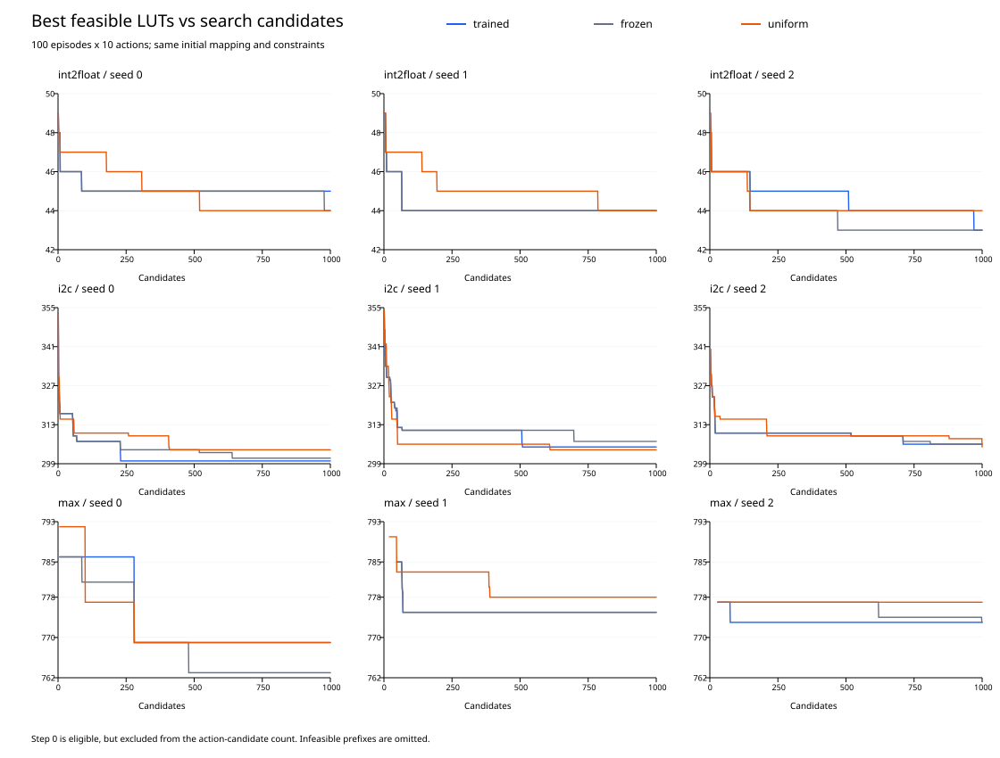
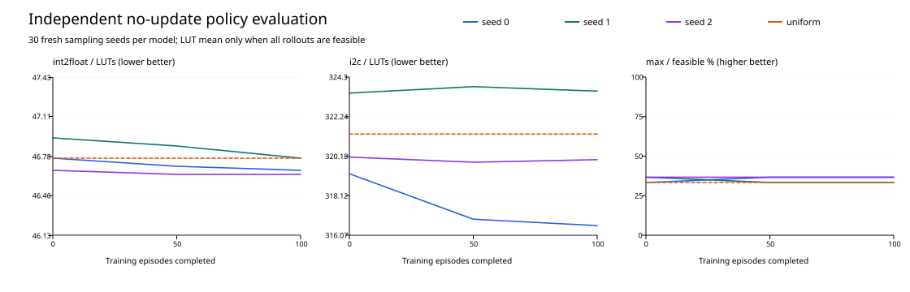

# DRiLLS 学习有效性实验报告

## Material Passport

- Origin Skill: academic-research-suite / experiment-agent
- Origin Mode: run + validate
- Origin Date: 2026-09-27
- Verification Status: VERIFIED（短程原实现一致性及断点恢复；完整实验日志复核）
- Version Label: learning_effectiveness_v1

## 主要发现

训练搜索完成 27/27 次，独立策略评估完成 36/36 组。本报告分别检验权重更新、策略改变和搜索收益，不把参数变化或奖励上升单独当作学习有效的证据。

更新检查：训练组 9/9 次 Actor 和 Critic 均改变，9/9 次固定探针动作分布改变；冻结和均匀随机组 18/18 次参数保持不变。只有完整运行后的诊断才计入此处。
int2float 的 1,000 候选搜索中，训练相对冻结的平均 LUT 减少量为 -0.333（-0.763%），逐种子差值为 [-1, 0, 0]。
i2c 的 1,000 候选搜索中，训练相对冻结的平均 LUT 减少量为 1.000（0.328%），逐种子差值为 [1, 2, 0]。
max 的 1,000 候选搜索中，训练相对冻结的平均 LUT 减少量为 -2.000（-0.260%），逐种子差值为 [-6, 0, 0]。
i2c 的训练和冻结逐种子最佳值均与历史 10 步实验完全相同，复现了“冻结与训练结果差异很小”的观察。历史 30 步结果只作背景，本次没有重跑，也不纳入新评估的统计。
int2float：100 轮策略在新种子评估中平均比初始化/冻结策略少 0.100 LUT。
i2c：100 轮策略在新种子评估中平均比初始化/冻结策略少 0.911 LUT。
max：100 轮策略可行 32/90，初始化/冻结 32/90；可行率变化 0.000 个百分点。存在不可行序列，未汇总 LUT 收益。
本次没有观察到训练策略对三个电路、两种基线都一致的搜索收益。这与“参数更新正常”并不矛盾，也不证明强化学习在其他预算或设置下无效。

## 条件与比较口径

使用原始 adf7bef 算法：int2float / i2c / max，深度限制 3 / 4 / 41，训练种子 0 / 1 / 2，100 轮 × 10 步，LUT6；原奖励、episode_welford 状态归一化、标准化回报、网络与 Adam 设置不变。初始映射可参与最优值。三组为训练、初始化权重冻结、均匀随机，各运行相同搜索预算。

训练/冻结初始网络、Adam 和采样 RNG 相同，第一轮轨迹相同。冻结网络按状态输出概率，并不等于均匀随机。第 0 / 50 / 100 轮模型分别用新种子 10000–10029 进行 30 条无更新的 10 步评估；冻结三个快照一致，故共享初始化策略评估。评估只涉及训练使用的电路，不是跨电路泛化测试。

各模型使用同一组评估随机数以便配对；均匀随机策略在三个训练种子行重复相同的 30 条序列，这些重复行不提供额外独立样本，统计重采样保留其相关性。

主指标为可行率和相同候选预算下的最优可行 LUT；完整序列终点为辅助指标。任何组有缺失或不可行时，不用筛掉这些运行后的均值判断优劣。

## 训练搜索结果

| 电路 | 组别 | seed 0 LUT | seed 1 LUT | seed 2 LUT | 均值 ± 总体标准差 |
|---|---|---:|---:|---:|---:|
| int2float | trained | 45 | 44 | 43 | 44.000 ± 0.816 |
| int2float | frozen | 44 | 44 | 43 | 43.667 ± 0.471 |
| int2float | uniform | 44 | 44 | 44 | 44.000 ± 0.000 |
| i2c | trained | 300 | 305 | 306 | 303.667 ± 2.625 |
| i2c | frozen | 301 | 307 | 306 | 304.667 ± 2.625 |
| i2c | uniform | 304 | 304 | 305 | 304.333 ± 0.471 |
| max | trained | 769 | 775 | 773 | 772.333 ± 2.494 |
| max | frozen | 763 | 775 | 773 | 770.333 ± 5.249 |
| max | uniform | 769 | 778 | 777 | 774.667 ± 4.028 |

| 电路 | 对照 | 逐种子 LUT 减少量（对照减训练） | 平均减少 LUT | 改善百分比 | 胜/平/负 |
|---|---|---|---:|---:|---|
| int2float | frozen | [-1, 0, 0] | -0.333 | -0.763% | 0/2/1 |
| int2float | uniform | [-1, 0, 1] | 0.000 | 0.000% | 1/1/1 |
| i2c | frozen | [1, 2, 0] | 1.000 | 0.328% | 2/1/0 |
| i2c | uniform | [4, -1, -1] | 0.667 | 0.219% | 1/0/2 |
| max | frozen | [-6, 0, 0] | -2.000 | -0.260% | 0/2/1 |
| max | uniform | [0, 3, 4] | 2.333 | 0.301% | 2/1/0 |

resyn2 基线：int2float: 48 LUT / 3 层；i2c: 322 LUT / 4 层；max: 777 LUT / 41 层。

完整搜索的可行结果为 27/27。训练表的胜/平/负按最佳可行 LUT 比较；每轮的可行结果和终点见 episodes.csv。

这些分数是 1,000 个动作候选中找到的最佳解，不能单独证明策略质量改善。



## 独立策略评估

| 电路 | 训练种子 | 初始/冻结均值 | 50 轮均值 | 100 轮均值 | 均匀随机均值 |
|---|---:|---:|---:|---:|---:|
| int2float | 0 | 46.767 (30/30) | 46.700 (30/30) | 46.667 (30/30) | 46.767 (30/30) |
| int2float | 1 | 46.933 (30/30) | 46.867 (30/30) | 46.767 (30/30) | 46.767 (30/30) |
| int2float | 2 | 46.667 (30/30) | 46.633 (30/30) | 46.633 (30/30) | 46.767 (30/30) |
| i2c | 0 | 319.267 (30/30) | 316.900 (30/30) | 316.567 (30/30) | 321.333 (30/30) |
| i2c | 1 | 323.467 (30/30) | 323.800 (30/30) | 323.567 (30/30) | 321.333 (30/30) |
| i2c | 2 | 320.133 (30/30) | 319.867 (30/30) | 320.000 (30/30) | 321.333 (30/30) |
| max | 0 | 未汇总 (10/30) | 未汇总 (11/30) | 未汇总 (11/30) | 未汇总 (10/30) |
| max | 1 | 未汇总 (11/30) | 未汇总 (10/30) | 未汇总 (10/30) | 未汇总 (10/30) |
| max | 2 | 未汇总 (11/30) | 未汇总 (11/30) | 未汇总 (11/30) | 未汇总 (10/30) |

每个均值来自固定模型的 30 条评估序列，各序列取包括初始映射在内的最佳可行解。括号为可行条数/30。存在不可行序列时，LUT 均值不汇总；优先比较可行率。底层逐条可行率、终点、奖励均在 evaluation.csv；未完成/不可行不被删除。



| 电路 | 对照策略 | 100 轮模型平均减少 LUT | LUT 探索性 95% 区间 | 可行率变化（百分点）及区间 | 可行优先胜/平/负 | 逐种子 LUT / 百分比 |
|---|---|---:|---|---|---|---|
| int2float | initial | 0.100 | [-0.178, 0.389] | 0.000 / [0.000, 0.000] | 18/59/13 | 0: 0.100 / 0.214%; 1: 0.167 / 0.355%; 2: 0.033 / 0.071% |
| int2float | uniform | 0.078 | [-0.300, 0.433] | 0.000 / [0.000, 0.000] | 24/49/17 | 0: 0.100 / 0.214%; 1: 0.000 / 0.000%; 2: 0.133 / 0.285% |
| i2c | initial | 0.911 | [-0.711, 2.767] | 0.000 / [0.000, 0.000] | 28/44/18 | 0: 2.700 / 0.846%; 1: -0.100 / -0.031%; 2: 0.133 / 0.042% |
| i2c | uniform | 1.289 | [-2.533, 4.989] | 0.000 / [0.000, 0.000] | 38/17/35 | 0: 4.767 / 1.483%; 1: -2.233 / -0.695%; 2: 1.333 / 0.415% |
| max | initial | 未汇总 | 未汇总 | 0.000 / [-6.667, 6.667] | 10/68/12 | 0: 未汇总 / 未汇总%; 1: 未汇总 / 未汇总%; 2: 未汇总 / 未汇总% |
| max | uniform | 未汇总 | 未汇总 | 2.222 / [-2.222, 8.889] | 18/57/15 | 0: 未汇总 / 未汇总%; 1: 未汇总 / 未汇总%; 2: 未汇总 / 未汇总% |

正值表示训练更好。胜负沿用环境排序：可行解优先；可行解先比较 LUT，再比较层数；两条都不可行时先比较层数，再比较 LUT。它保留所有评估，不赋予不可行解任意 LUT 罚分。配对分层 bootstrap 先重采样 3 个训练种子，再重采样配对评估序列，所有训练种子共同重采样同一组评估种子列，以保留共同随机数及均匀随机基线重复使用的相关性。重复 10,000 次，分析种子 20260927。只有 3 个独立训练种子，区间为探索性估计；90 条评估序列不能当作 90 次独立训练。未预设实用收益门槛，不作统计等效判断。评估原则参照 [Agarwal 等](https://arxiv.org/abs/2108.13264)和 [Henderson 等](https://arxiv.org/abs/1709.06560)。

| 电路 | 策略 | 终点可行 / 90 | 终点 LUT 均值 | 终点层数均值 | 原始奖励和均值 |
|---|---|---:|---:|---:|---:|
| int2float | initial | 76/90 | 未汇总 | 3.156 | 3.056 |
| int2float | trained-50 | 79/90 | 未汇总 | 3.122 | 3.700 |
| int2float | trained-100 | 80/90 | 未汇总 | 3.111 | 4.056 |
| int2float | uniform | 69/90 | 未汇总 | 3.233 | 2.933 |
| i2c | initial | 90/90 | 322.111 | 3.978 | 17.900 |
| i2c | trained-50 | 90/90 | 322.133 | 3.933 | 18.256 |
| i2c | trained-100 | 90/90 | 321.944 | 3.944 | 18.044 |
| i2c | uniform | 90/90 | 323.900 | 3.933 | 17.000 |
| max | initial | 32/90 | 未汇总 | 42.089 | 3.822 |
| max | trained-50 | 32/90 | 未汇总 | 41.978 | 4.056 |
| max | trained-100 | 32/90 | 未汇总 | 41.911 | 3.978 |
| max | uniform | 30/90 | 未汇总 | 42.400 | 4.167 |

终点层数和奖励在完整评估中不筛样本；终点 LUT 均值只在全部终点可行时汇总。

## 学习链路与机制诊断

| 电路 | seed | Actor 参数变化 RMS | Critic 参数变化 RMS | 固定探针 KL | 策略熵 |
|---|---:|---:|---:|---:|---:|
| int2float | 0 | 0.009814 | 0.019471 | 0.011438 | 1.921120 |
| int2float | 1 | 0.011946 | 0.021354 | 0.012338 | 1.876392 |
| int2float | 2 | 0.014317 | 0.018045 | 0.020852 | 1.886089 |
| i2c | 0 | 0.008335 | 0.032432 | 0.018859 | 1.831177 |
| i2c | 1 | 0.009962 | 0.023412 | 0.025670 | 1.815692 |
| i2c | 2 | 0.007517 | 0.031606 | 0.005265 | 1.910405 |
| max | 0 | 0.010156 | 0.036458 | 0.005583 | 1.886377 |
| max | 1 | 0.009704 | 0.030758 | 0.006573 | 1.895853 |
| max | 2 | 0.016969 | 0.030253 | 0.057600 | 1.809086 |

诊断使用第一轮保存的归一化输入作为固定探针，逐轮记录损失、梯度、更新量、回报尺度和动作概率，不消耗采样随机数。固定探针只能覆盖这些输入附近的策略变化，不能证明全部状态空间都学得更好。

| 电路 | 组别 | 零奖励比例 | LUT 往返次数 | 其中两步正奖励次数 |
|---|---|---:|---:|---:|
| int2float | trained | 51.13% | 151 | 151 |
| int2float | frozen | 49.57% | 143 | 143 |
| int2float | uniform | 53.70% | 118 | 118 |
| i2c | trained | 17.10% | 101 | 101 |
| i2c | frozen | 18.30% | 92 | 92 |
| i2c | uniform | 19.73% | 93 | 93 |
| max | trained | 53.17% | 0 | 0 |
| max | frozen | 53.93% | 3 | 3 |
| max | uniform | 56.53% | 1 | 1 |

每轮首个状态归一化为全零；固定输入/输出数等特征可能持续为零。behavior 字段保存逐种子的常量特征名单。可行区域减少 LUT 奖励 +3，增加奖励 −1，因此 LUT 数降低再恢复的两步过程获得正奖励。这里检测的是 LUT 数往返，不能据此断言网表完全回到原状态。单个电路每轮起点本来固定，首态归零本身不能证明故障。奖励与面积目标错位、状态信息损失、搜索最佳值掩盖策略变化是机制解释候选；本实验未修改这些设置来验证因果。

## 证据、限制与复现

测试覆盖原实现与诊断路径的精确权重/Adam/RNG/动作一致性、冻结、第一轮配对、三组真实工具断点恢复、非法续跑拒绝和受控正优势更新。完整实验按逐步日志重新计算奖励、回报尺度、最优值和终点；训练及评估导出的最佳映射通过 ABC CEC。测试和验证记录见 tests.log、test-results.json、validation.json。

最终逐一复核 1110 份导出结果，合计 2217 个映射及未映射网表通过 CEC；完整命令、网表哈希与验证输出哈希见 netlist-validation.json。

完整实验每个训练种子只运行一次，未另做全部 27 次同种子重复；可复现性证据来自短程精确回归与断点恢复，不能把“完整日志复核”表述为“全部实验独立重复成功”。耗时包含额外诊断开销且并发共享资源，本报告依据候选预算比较搜索质量，不根据耗时给算法效率排名。

本次正式执行耗时：training 34.699 分钟；evaluation 16.053 分钟。使用 3 个 workers、每进程 1 个 Torch 线程，每分钟记录进度，单任务硬超时 30 分钟；起止时间、逐任务命令与退出状态见 provenance.json 和 evaluation-provenance.json。

核查了 11 类统计解释风险：辛普森悖论（逐电路报告）、生态谬误（训练种子是独立单位）、选择偏差与碰撞变量（不按结果筛样本）、基率忽略（完整可行率）、回归均值（固定种子与对照）、幸存者偏差（保留失败）、多重搜索与分析分叉（预定六个探索性对照，不据此宣称显著）、相关当因果与反向因果（仅对受控冻结干预和已测范围解释）。覆盖 11/11，少训练种子限制仍然存在。

## 如何判断学习有效及下一步

第一层检查 Actor/Critic 的梯度、参数和 Adam 状态，配合严格不变的冻结对照，确认更新发生。第二层在固定归一化输入上比较动作概率，确认策略改变。第三层使用未参与更新的新采样种子，检验固定模型在相同约束和候选预算下是否优于初始化网络与均匀随机，并呈现全部训练种子及不确定性。前两层通过、第三层没有一致收益时，应表述为“发生了学习更新，但当前设置下未验证出稳定搜索收益”。

若继续确认收益，应增加独立训练种子并使用新的预先固定评估种子。若尝试改进，分别对奖励与面积目标的对齐、状态归一化做单因素对照，保持搜索预算；不要同时改多项再将提升归因于某一机制。第 50 轮仅为预定诊断点，不根据结果事后将更好的中间模型替换第 100 轮主对照。

源码/配置/工具/电路指纹和完整命令见 provenance.json、evaluation-provenance.json；统计生成代码和配对方法见 analysis-provenance.json；压缩证据 evidence.tar.gz 内有 SHA256.json。完整权重和原始输出保存在 results/learning-effectiveness/。模型与探针未纳入 Git；model-manifest.json 记录本机权重哈希。其他机器需要重新训练或复制这些权重，仅凭压缩日志不能重放固定模型评估。historical-reference.json 记录历史文件哈希复核，历史 results/ 其他实验未改写。AI 用于实现实验、核对日志、统计与报告撰写。

```bash
.tools/conda-env/bin/python -B -m unittest discover -s tests -v
# 保存完整测试输出及命令/源码哈希
.tools/conda-env/bin/python -B experiments/learning-effectiveness/check.py
.tools/conda-env/bin/python -B -u experiments/learning-effectiveness/run.py
# 中断后，仅相同源码/配置/工具允许续跑
.tools/conda-env/bin/python -B -u experiments/learning-effectiveness/run.py --resume
.tools/conda-env/bin/python -B -u experiments/learning-effectiveness/evaluate.py
.tools/conda-env/bin/python -B experiments/learning-effectiveness/verify.py
# 已有完整评估时，重读证据生成报告
.tools/conda-env/bin/python -B experiments/learning-effectiveness/evaluate.py --report-only
```

在仓库根目录执行。首次完整重跑需使用新的干净结果目录；已有相同指纹结果使用 --resume，已有完整输出重新分析使用 --report-only。原始输出路径由 protocol.yml 指定，默认命令不会覆盖历史实验。

图表由 plot.py 使用带 ReportLab 与 PyMuPDF 的 Python 运行环境生成；plot-validation.json 保存本次实际命令和版本。随后运行 package.py 核对交付哈希和历史文件保留情况，artifact-manifest.json 汇总所有交付物的哈希。
